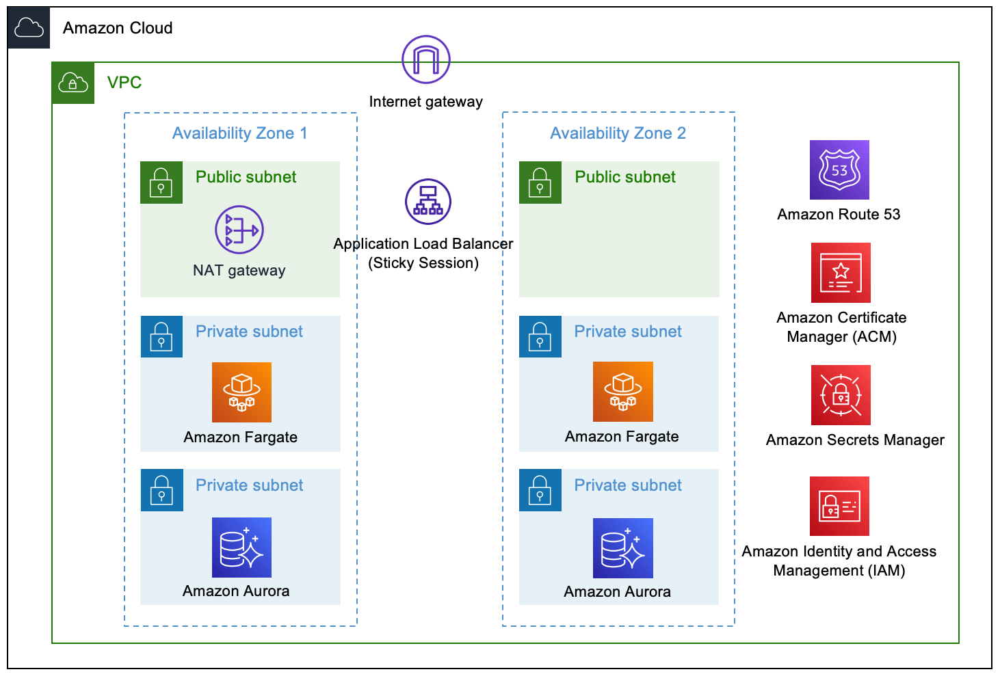

# Keycloak on AWS

[中文](./README.zh.md)

This is a solution for deploying [Keycloak](https://www.keycloak.org/) to AWS with high availability. Keycloak is a single sign-on (SSO) solution for web applications and RESTful web services. Keycloak's goal is to simplify security so that application developers can easily protect applications and services already deployed in their organizations. Out of the box, Keycloak provides security features that developers would normally have to write for themselves and can be easily customized for the individual needs of the organization. Keycloak provides a customizable user interface for login, registration, administration and account management. You can also use Keycloak as an integration platform to hook into existing LDAP and Active Directory servers. You can also delegate authentication to third-party identity providers, such as Facebook and Google+.

## Architecture diagram

- A highly available architecture that spans two [Availability Zones][Availability Zones].
- A [Amazon Virtual Private Cloud (Amazon VPC)][Amazon VPC] configured with public and private subnets, according to AWS best practices, to provide you with your own virtual network on AWS.
- In the public subnets, managed Network Address Translation (NAT) gateways to allow outbound internet access for resources in the private subnets.
- In the private subnets:
	- [Amazon Elastic Container Service (Amazon ECS)][Amazon ECS] tasks running with [AWS Fargate][AWS Fargate] behind the [Application Load Balancer][Application Load Balancer].
	- [Amazon Aurora Serverless MySQL-Compatible][Amazon Aurora Serverless] database cluster or [Amazon Aurora MySQL-Compatible][Amazon Aurora] cluster.
- [IAM][AWS Identity and Access Management] role for the [Amazon ECS][Amazon ECS] service.
- Secrets from [AWS Secrets Manager][AWS Secrets Manager] for [Keycloak][Keycloak] console login and database connection.
- [AWS Certificate Manager (ACM)][Amazon Certificate Manager], which uses your existing certificate for the custom domain name on the [Application Load Balancer][Application Load Balancer].
- [Amazon Route 53][Amazon Route 53] alias record, which is required for the custom domain name.

## Quick start

* [Implementation Guide](https://aws-samples.github.io/keycloak-on-aws/en/implementation-guide/deployment/)

## License

Copyright 2021 Amazon.com, Inc. or its affiliates.

Licensed under the Apache License Version 2.0 (the "License"). You may not use this file except in compliance with the License. A copy of the License is located at

    http://www.apache.org/licenses/

This file is distributed on an "AS IS" BASIS, WITHOUT WARRANTIES OR CONDITIONS OF This file is distributed on an "AS IS" BASIS, WITHOUT WARRANTIES OR CONDITIONS OF ANY KIND, express or implied. See the License for the specific language governing permissions and limitations under the License.

[Availability Zones]: https://aws.amazon.com/about-aws/global-infrastructure/regions_az/
[AWS CloudFormation]: https://aws.amazon.com/cloudformation/
[Amazon VPC]: https://aws.amazon.com/vpc/
[AWS Fargate]: https://aws.amazon.com/fargate/
[Amazon ECS]: https://aws.amazon.com/ecs/
[Amazon ECR]: https://aws.amazon.com/ecr/
[Application Load Balancer]: https://aws.amazon.com/elasticloadbalancing/application-load-balancer/
[Amazon Certificate Manager]: https://aws.amazon.com/certificate-manager/
[AWS Identity and Access Management]: https://aws.amazon.com/iam/
[Amazon Route 53]: https://aws.amazon.com/route53/
[Amazon Aurora]: https://aws.amazon.com/rds/aurora/
[Amazon Aurora Serverless]: https://aws.amazon.com/rds/aurora/serverless/
[AWS Secrets Manager]: https://aws.amazon.com/secrets-manager/
[Keycloak]: https://www.keycloak.org/
