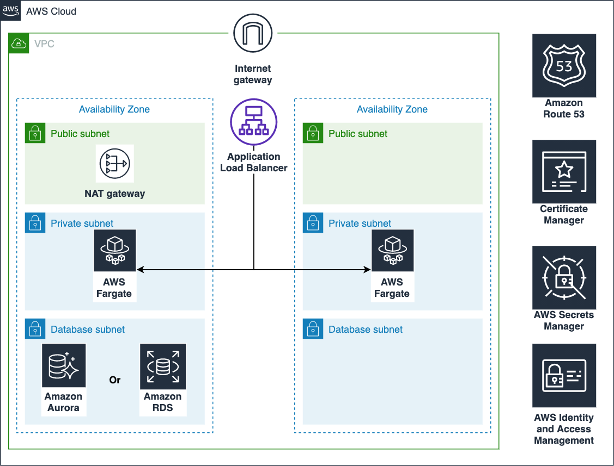

# Keycloak on AWS

[中文](./README.zh.md)

This is a solution for deploying [Keycloak](https://www.keycloak.org/) to AWS with high availability. Keycloak is a single sign-on (SSO) solution for web applications and RESTful web services. Keycloak's goal is to simplify security so that application developers can easily protect applications and services already deployed in their organizations. Out of the box, Keycloak provides security features that developers would normally have to write for themselves and can be easily customized for the individual needs of the organization. Keycloak provides a customizable user interface for login, registration, administration and account management. You can also use Keycloak as an integration platform to hook into existing LDAP and Active Directory servers. You can also delegate authentication to third-party identity providers, such as Facebook and Google+.

## Architecture diagram



1. NAT Gateway serves as the public access outlet for the private subnet.
2. Application Load Balancer distributes traffic to the AWS ECS Fargate application layer service. In addition, ALB also enables Sticky Sessions to implement distributed sessions. For more details, please refer to [Keycloak documentation](https://www.keycloak.org/docs/latest/server_installation/index.html#sticky-sessions).
3. You can choose Amazon Aurora Serverless to reduce costs or Amazon RDS MySQL for the database layer.
4. Both the database account password and the Keycloak administrator login account password are automatically generated using AWS Secrets Management to ensure security.
You will need to provide an AWS Certificate Manager certificate for Arn to provide HTTPS access to the ALB

## AWS CloudFormation Deployment Link

| Link                                         | Description                                                                    |
| -------------------------------------------- | ------------------------------------------------------------------------------ |
| keycloak-aurora-serverless-from-existing-vpc | Deploying AuroraServerless from an existing VPC as a Keycloak for the database |
| keycloak-aurora-serverless-from-new-vpc      | Keycloak for deploying AuroraServerless as a database from a new VPC           |
| keycloak-from-existing-vpc                   | Keycloak for deploying RDS MySQL as a database from an existing VPC            |
| keycloak-from-new-vpc                        | New VPC Deploying RDS MySQL as Keycloak for Database                           |

## Deployment Guide

| parameter-name | explanation                                    |
| -------------- | ---------------------------------------------- |
| CertificateArn | Arn of the AWS Secrets Management certificate  |
| VpcId          | The Id of the VPC                              |
| PubSubnets     | Public Subnets                                 |
| PrivSubnets    | Private Subnets                                |
| DBSubnets      | Database Subnets                               |
| NodeCount      | Number of application layer nodes (at least 2) |

Once the stack is created, look for the Keycloak administrator login password in AWS Secrets Management

## Deploy from CDK

```shell
$ cd source
$ npm i

$ npm run cdk deploy keycloak-aurora-serverless-from-existing-vpc -- --parameters CertificateArn=xxx --parameters VpcId=xxx ...
$ npm run cdk deploy keycloak-aurora-serverless-from-new-vpc -- --parameters CertificateArn=xxx
$ npm run cdk deploy keycloak-from-existing-vpc -- --parameters CertificateArn=xxx --parameters VpcId=xxx ...
$ npm run cdk deploy keycloak-from-new-vpc -- --parameters CertificateArn=xxx
```

> Note: [Please make sure the CDK is properly Bootstrap](https://docs.aws.amazon.com/cdk/latest/guide/bootstrapping.html)

***

Copyright 2021 Amazon.com, Inc. or its affiliates.

Licensed under the Apache License Version 2.0 (the "License"). You may not use this file except in compliance with the License. A copy of the License is located at

    http://www.apache.org/licenses/

This file is distributed on an "AS IS" BASIS, WITHOUT WARRANTIES OR CONDITIONS OF This file is distributed on an "AS IS" BASIS, WITHOUT WARRANTIES OR CONDITIONS OF ANY KIND, express or implied. See the License for the specific language governing permissions and limitations under the License.
