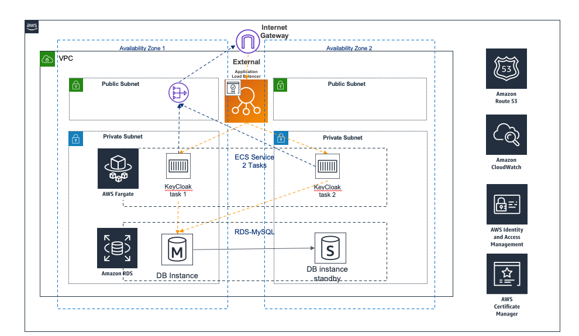

# 背景
AWS Cognito User Pool是AWS做为身份池的托管服务，在许多AWS Solutions或是用户创建的WEB/移动端应用都被广泛的使用。通过该服务可以快速建立一个身份池并与AWS的其他服务集成，并用来做身份认证和授权。一个常用的场景是API Gateway可以集成Cognito User Pool进行用户身份认证与授权，方便对API进行保护。另一个常用的场景是结合Cognito Identity Pool来在Web或移动端安全地获取AWS临时密钥，进而访问其他AWS服务。

# 解决方案概览
2014 年，AWS IAM 使用 OpenID Connect (OIDC) 增加了对联合身份的支持。此功能允许您通过支持的身份提供商对 AWS API 调用进行身份验证，并获得有效的 OIDC Web 令牌 (JWT)。您可以将此令牌传递到 AWS STS AssumeRoleWithWebIdentity API 操作并接收 IAM 临时角色凭证。您可以使用这些凭证与任意 AWS 服务交互，例如 Amazon S3 和 DynamoDB。
Keycloak是一个开放源代码身份和访问管理解决方案。 它可以使用内置的数据库，也可以使用传统的关系型数据库例如 MySQL来存储用户登录信息。 它可以帮助在用户在应用程序之上构建安全层，并且可以同 AWS 的 Cognito Identiy Pool 相集成。
本解决方案基于 Keycloak 的容器镜像文件，结合 AWS 的 ECS，Fargate 及 RDS for MySQL 等服务，提供一个高可用的架构的自动化部署方式。

# 挑战
目前Cognito User Pool服务在 ZHY 及 BJS Region尚未发布，这对将Global AWS Solutions或用户应用迁移至国内区域部署造成困难。需要找到找到一个基于 OpenID Connect 协议的开源软件来替代Cognito User Pool的认证服务功能。
另外虽然AWS 的合作伙伴也有类似的解决方案，例如 authing.cn (http://authing.cn/) 的方案，但使用合作伙伴的 Saas 服务时用户数据是存储在第三方。不管是从合规的角度或是对于安全性有特殊要求的用户，还是希望类似用户名及密码数据存储在自己的 AWS 账户内
用户希望能找到一个方案以支持OpenID Connect或SAML 2.0等开放协议标准，并且需要能灵活地结合 AWS 的 cognito identity pool 进行联合的身份验证。


# 系统架构图


# KeyCloak介绍

KeyCloak是针对Web应用程序和RESTful Web服务的单一登录解决方案。 KeyCloak的目标是简化安全性，以便应用程序开发人员可以轻松保护已部署在组织中的应用程序和服务。 开箱即用地提供了开发人员通常必须为自己编写的安全功能，可以轻松地针对组织的个性化需求进行定制。 Keycloak提供可自定义的用户界面，用于登录，注册，管理和帐户管理。 您还可以将Keycloak用作集成平台，以将其挂接到现有的LDAP和Active Directory服务器中。 您还可以将身份验证委派给第三方身份提供商，例如Facebook和Google+。

 Keycloak使用OpenID Connect或SAML 2.0等开放协议标准来保护您的应用程序。 浏览器应用程序将用户的浏览器从应用程序重定向到Keycloak身份验证服务器，并在其中输入其凭据。 这很重要，因为用户与应用程序完全隔离，并且应用程序永远看不到用户的凭据。 相反，为应用程序提供了经过密码签名的身份令牌或断言。 这些令牌可以具有身份信息，例如用户名，地址，电子邮件和其他配置文件数据。 他们还可以保存权限数据，以便应用程序可以做出授权决策。 这些令牌还可以用于对基于REST的服务进行安全调用。

Keycloak是为现代应用和服务提供了开源IAM(Identity and Access Management)解决方案，其基于标准协议，并提供对OpenID Connect，OAuth 2.0和SAML的支持。

# 架构决策

## 为什么使用Fargate来部署KeyCloak

Keycloak作为基础的身份认证服务，势必要部署多个实例组成集群以保证高可用性, 而容器技术可以在failover后实现秒级启动，借助firecracker技术，fargate中的keycloak 容器启动时间可以缩短至毫秒级别。借助Fargate服务，您的用户部署此方案时不必管理 Amazon EC2 实例的服务器或集群，无需预置和管理服务器，可避免扩展、修补、保护和管理服务器的运营开销，这样就无需再选择服务器类型、确定扩展集群的时间和优化集群打包 ，Fargate 可确保运行您容器的基础设施始终通过所需的补丁保持最新状态。Fargate 也可以缩放计算资源，以密切符合计算资源的需求，无需超额预置并为额外的服务器付费。

## 为什么使用Autoscaling

在Fargate中，会同时启动两个以keycloak docker image为镜像的task。当两个Fargate task同时启动时，keycloak docker image会首先进行初始化过程。
在初始化的过程中会对相连的数据库进行初始化操作，其中包括创建相应的表等操作，如果两个task同时启动则会陷入相互竞争的局面，导致两个task的初始化过程纷纷报错而失败，所以需要有一个单独的初始化过程，待初始化过程结束再进行生产环境高可用部署。
所以我们选择使用autoscling group 中启动ec2来执行单独的初始化工作，待初始化工作完成后可以将autoscling group内的机器数量改为0，即可不再占用任何计算资源，顺利过渡到生产环境的高可用task部署阶段。


# 使用场景
当您使用 OIDC IdP 登录您的应用程序时，具体的步骤如下：

1. 您的用户将登录Keycloak内置登录页面，并获得通过 OIDC IdP 登录的选项。
2. 您的用户将重定向到 OIDC IdP 的 authorization 终端节点。
3. 在您的用户经过身份验证后，OIDC IdP 将使用授权代码重定向至 Keycloak。
4. Keycloak 将与 OIDC IdP 交换此授权代码以获得访问令牌。
5. Keycloak在您的用户池中创建或更新用户账户。
6. Keycloak 颁发应用程序持有者令牌，可能包括身份、访问和刷新令牌。

OIDC 是基于 OAuth 2.0 的身份层，它指定 IdP 向 OIDC 客户端应用程序 (信赖方) 颁发的 JSON 格式的 (JWT) 身份令牌。有关将 Amazon Cognito 添加为 OIDC 信赖方的信息，请参阅您的 OIDC IdP 的文档。
当用户进行身份验证后，用户池将返回 ID Token，Access Token和 Refesh Token。ID Token是用于身份管理的标准 OIDC (http://openid.net/specs/openid-connect-core-1_0.html) 令牌，而Access Token是标准 OAuth 2.0 (https://oauth.net/2/) 令牌。

# 如何进行构建

```
cd deployment
chmod +x ./build-s3-dist.sh \n
./build-s3-dist.sh TEMPLATE_BUCKET_NAME $DIST_OUTPUT_BUCKET $SOLUTION_NAME $VERSION \n
```

例如: 如果需要需要在 S3存储桶 （s3bucketname） 中 则需要运行

```
./build-s3-dist.sh s3bucketname s3bucketname fortinet-fortiweb-waf-for-aws v1.0.0 
```

*** 

## 目录结构

```
|-deployment/
  |-global-s3-assets/            [ contents which will be uploaded to TEMPLATE_OUTPUT_BUCKET ]
  |-regional-s3-assets/          [ contents which will be uploaded to DIST_OUTPUT_BUCKET-<aws_region> ]
  |-build-s3-dist.sh             [ shell script for packaging distribution assets ]
  |-run-unit-tests.sh            [ shell script for executing unit tests ]
  |-solution.yaml                [ solution CloudFormation deployment template ]
|-source/
  |-example-function-js          [ Example microservice function in javascript ]
    |- lib/                      [ Example function libraries ]
  |-example-function-py          [ Example microservice function in python ]

```


***


Copyright 2019 Amazon.com, Inc. or its affiliates. All Rights Reserved.

Licensed under the Apache License Version 2.0 (the "License"). You may not use this file except in compliance with the License. A copy of the License is located at

    http://www.apache.org/licenses/

or in the "license" file accompanying this file. This file is distributed on an "AS IS" BASIS, WITHOUT WARRANTIES OR CONDITIONS OF ANY KIND, express or implied. See the License for the specific language governing permissions and limitations under the License.
