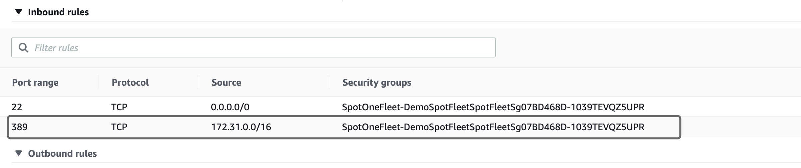
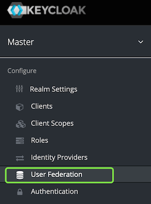
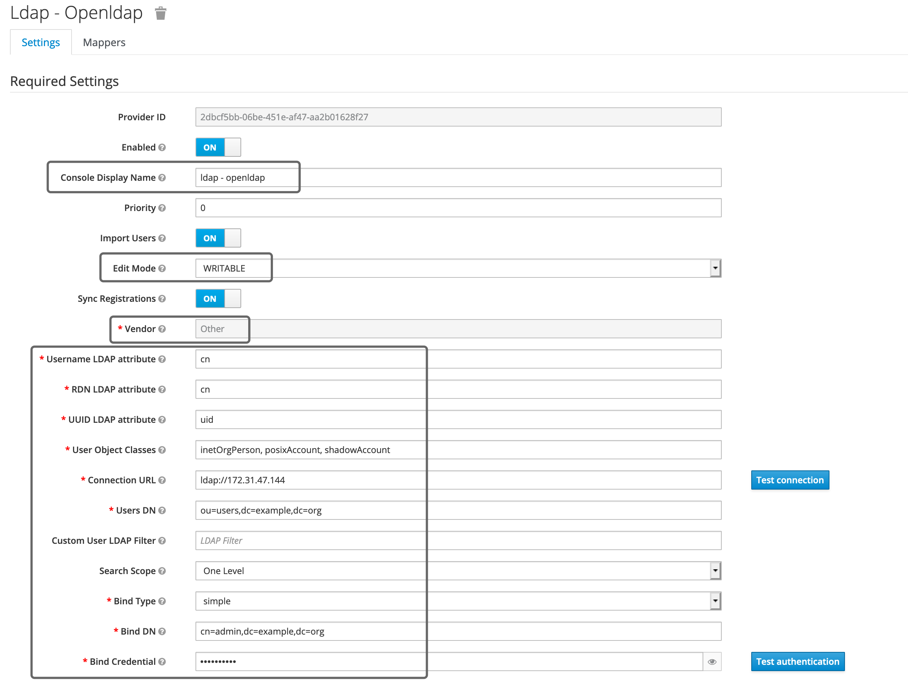
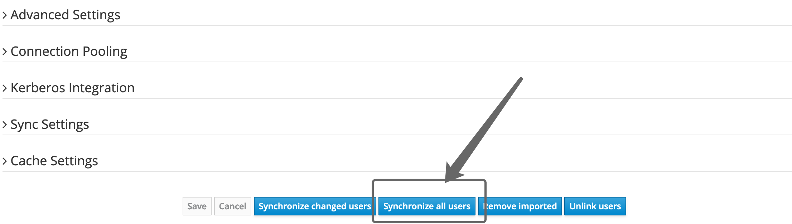
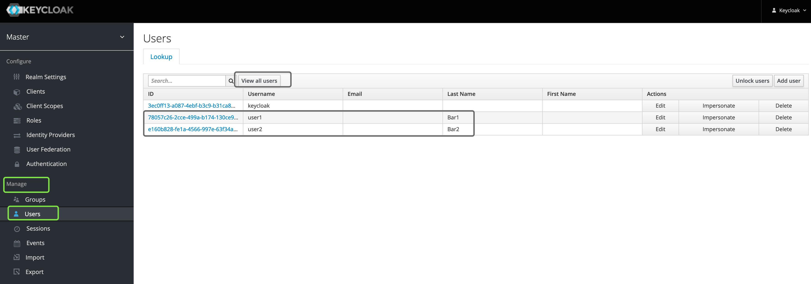
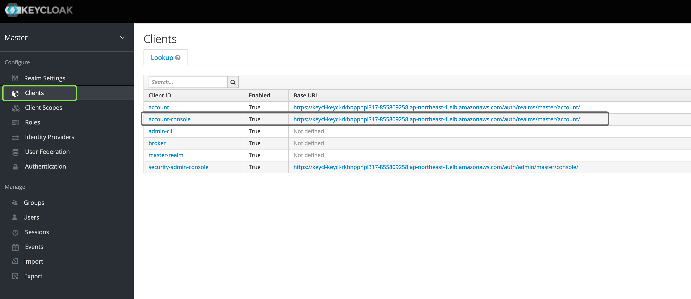
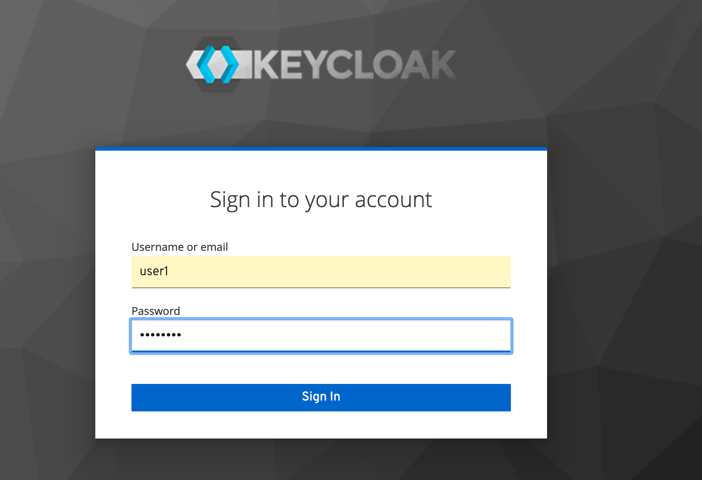
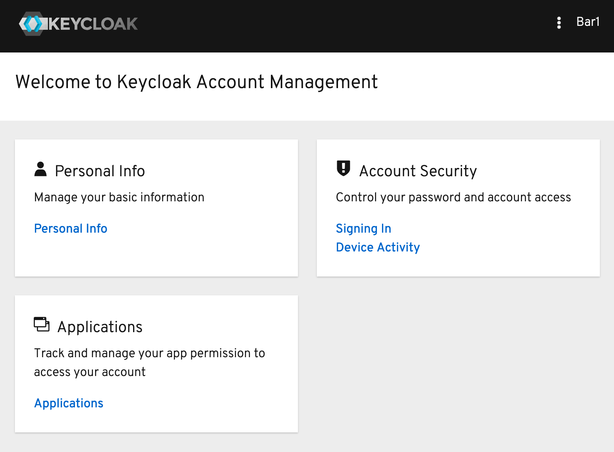

# User Federation in AD/LDAP

Keycloak allows user federation with AD/LDAP. This guide walks you through the user federation with `OpenLDAP` service. For more infomation, see [User Federation](https://www.keycloak.org/docs/latest/server_admin/#_user-storage-federation) from the Keycloak document.


# Prerequisities

1. `Keycloak on AWS` - We assume you have already deployed the [keycloak-on-aws](https://github.com/aws-samples/keycloak-on-aws) via cloudformation or AWS CDK and already successfully logged in the keycload dashboard as `keycloak` admin user.

2. `OpenLDAP` - Keycloak supports multiple LDAP services including Microsoft AD and [OpenLDAP](https://www.openldap.org/). In the following guide, we will run an openldap service in the same VPC with the keycloak service for this demo. 

# Create a OpenLDAP service

We are going to deploy an openldap service as container from the official [bitnami/openldap](https://gallery.ecr.aws/bitnami/openldap) from Amazon ECR public gallery:

1. launch an Amazon Linux 2 EC2 instance in the same VPC with the your keycloak service
2. Log in the EC2 instance and run the command to bring up the openldap service:

```sh
image='public.ecr.aws/bitnami/openldap:latest'

docker run -p 389:1389 $image
```

This will bring up the openldap service with docker and keep it running in the foreground. Leave this terminal open.

Under the covers, the `bitnami/openldap` will create `user01` and `user02` as initial users with their default passwords. See the [description](https://gallery.ecr.aws/bitnami/openldap) for more details about the customization.


3. configure the security group of this EC2 instance and ensure all traffic from the VPC CIDR can visit its LDAP port(`TCP 389`)



4. Open another termilal and install the openldap clients on the same EC2. 

```sh
# install ldap client
yum install openldap-clients
# list all users
ldapsearch -x -b "ou=users,dc=example,dc=org" -H ldap://<EC2_PRIVATE_IP>
```

For example:

```
#  ldapsearch -x -b "ou=users,dc=example,dc=org" -H ldap://172.31.47.144
# extended LDIF
#
# LDAPv3
# base <ou=users,dc=example,dc=org> with scope subtree
# filter: (objectclass=*)
# requesting: ALL
#

# users, example.org
dn: ou=users,dc=example,dc=org
objectClass: organizationalUnit
ou: users

# user01, users, example.org
dn: cn=user01,ou=users,dc=example,dc=org
cn: User1
cn: user01
sn: Bar1
objectClass: inetOrgPerson
objectClass: posixAccount
objectClass: shadowAccount
userPassword:: Yml0bmFtaTE=
uid: user01
uidNumber: 1000
gidNumber: 1000
homeDirectory: /home/user01

# user02, users, example.org
dn: cn=user02,ou=users,dc=example,dc=org
cn: User2
cn: user02
sn: Bar2
objectClass: inetOrgPerson
objectClass: posixAccount
objectClass: shadowAccount
userPassword:: Yml0bmFtaTI=
uid: user02
uidNumber: 1001
gidNumber: 1001
homeDirectory: /home/user02

# readers, users, example.org
dn: cn=readers,ou=users,dc=example,dc=org
cn: readers
objectClass: groupOfNames
member: cn=user01 cn\3Duser02,ou=users,dc=example,dc=org

# search result
search: 2
result: 0 Success

# numResponses: 5
# numEntries: 4
```

Now your default LDAP service is ready.


# Create a User Federation on Keycloak

1. Login the Keycloak dashboard as `keycloak` admin user.

2. Select **Configure** , **User Federation**



3. Create a LDAP provider as the screenshot below:



Make sure the **Connection URL** points to your private IP of the EC2 isntance.

Enter `adminpassword` for the **Bind credential**

Click the **TEst connection** and **Test Authentication** buttons to ensure everything is working.

Scroll down and click `Synchronize all users`, and 2 users should be imported.




Click **Manage**, **Users** from the left panel. `user1` and `user2` should be imported successfully.




# Validate the user federation 

Now let's validate the user federation with the `account-console` login.

Go to **Clients** and click the link of `account-console`



You should be redirected to the Keycloak account console, click **Sign Out** and **Sign In** on the top right button. Now enter the federated user credentials as:

Username: **user1**
Password: **bitnami1**




And you should be able to successfully sign in with your LDAP user credentials.



# FAQ

**Q: Does keycloak support `ldaps` protocol?**

A: Yes. both `ldap://` and `ldaps://` are supported. To enable `ldaps://`, make sure your AD/LDAP is running with `LDAPS` and has properly imported the certificate.


**Q: What vendor type should I select if I am running Microsoft AD server?**

A: Select **Active Directory** in the **Vendor** parameter.


