# Background

This deployment guide describes in detail how to deploy Keycloak on the cloud using the AWS CloudFormation template to build a Keycloak on AWS highly available architecture.

# Solution Description

Keycloak's containers are deployed and run on [AWS Fargate](https://amazonaws-china.com/fargate/), and with AWS Fargate, you do not need to pre-populate and manage container instances. To ensure high system availability, the [Amazon ECS](https://amazonaws-china.com/ecs/) service defines two tasks so that if one task fails to provide service, the other task can still provide service to the public.

In addition, this solution uses [Amazon RDS](https://amazonaws-china.com/rds/) as the system database to store Keycloak's configuration and user information. To ensure high availability and information security of the system. By default, [Amazon RDS Multi-Availability Zone Deployment Method](https://aws.amazon.com/cn/rds/features/multi-az/) is used, and the database runs in each availability zone and has been designed to have high reliability. In the event of an infrastructure failure, Amazon RDS automatically fails over to a standby instance so you can resume database operations as soon as the failover is complete. In addition, the solution also supports the option of [Amazon Aurora Serverless](https://aws.amazon.com/cn/rds/aurora/serverless/) database clustering, where Amazon Aurora Serverless automatically starts, shuts down, and scales based on application Amazon Aurora Serverless automatically starts up, shuts down, and scales up or down depending on the needs of the application, allowing you to run databases in the cloud without having to manage any database instances.

Regardless of the database type selected, the default database password is automatically generated and stored in [AWS Secrets Manager](https://aws.amazon.com/cn/secrets-manager/) at the time of deployment.

# Usage Scenarios

Keycloak is an out-of-the-box open source identity and access control software that provides single sign-on (SSO) functionality and supports OpenID Connect, OAuth 2.0, and SAML 2.0 standard protocols. Customizable user interface for login, registration, administration and account management. In addition, users can integrate Keycloak with [Amazon Cognito](https://amazonaws-china.com/cognito/) or with other existing LDAP and [Azure Active Directory](https://azure.microsoft.com/en-us/services/active-directory/) servers for integration. Users can also delegate authentication to third-party identity providers.

## System Architecture

## Architecture diagram
This solution can be deployed in the AWS (Ningxia) region operated by Xiyun Data or the AWS (Beijing) region operated by Huanhuan Xinwang, or in other AWS overseas regions.

## Components

### Amazon ECS

- This solution runs Amazon ECS clusters using AWS Fargate, which is a serverless computing service for containers. With AWS Fargate, you don't need to on-premises and manage servers, and you can assign and pay for resources for each application and improve security by designing to isolate applications.

- To ensure high system availability, two tasks are defined in the Amazon ECS service so that if one task fails to provide service, the other task continues to provide service.

- Amazon ECS supports Docker and enables you to run and manage Docker containers. Keycloak's container images are deployed and run on Amazon ECS without any configuration changes.

### Amazon ECR

- Used to store Keycloak's Docker image files.
### Amazon Certificate Manager (ACM)
- SSL Certificate in Https listener (TLS: 443) for ALB.

### Amazon Identity and Access Management (IAM)

- Cognito Identity pool for user authentication in conjunction with Keycloak. There can be two Roles, one owned by users who are not logged in and one owned by users who are logged in, and depending on the Policy owned by the Role, users can access different AWS services.

### Amazon Route 53

- Used for domain name resolution and ACM certificate creation authentication.

### Amazon RDS

- The database type is Amazon RDS for MySQL.
- The default database instance type is db.r5.large.
- Default uses Amazon RDS Multi-Available Zone deployment.
- The default automatic backup is 7 days.
- KMS encryption is enabled by default.
- Option to use Amazon Aurora Serverless
- Optionally use a single Amazon RDS instance

### AWS Secrets Manager
- Automatically generates and stores the initial username and password for the Keycloak administrator account
- Automatically generates and stores initial administrator account username, password, and connection domain and port information for the database

## Deployment Instructions

## Deployment prerequisites

1. the domain name has been recorded by ICP and used to apply for ACM certificate.
2. the certificate of the domain name is created in ACM and verified by the domain name.
3. VPC with 4 subnets (including two public subnets and two private subnets) and NAT Gateway.

## Create ACM certificate

In order to ensure that Keycloak can connect to the Cognito Identity pool, it is necessary to ensure that Keycloak provides in HTTPS service. This means that an ACM certificate or a third-party certificate must be used. For details on how to use it, please refer to.
[How to upload an SSL certificate and import it into AWS Identity and Access Management (IAM)](https://aws.amazon.com/cn/premiumsupport/knowledge-center/import-ssl-certificate-to-iam/)

This deployment guide illustrates the use of AWS Certificate Manager (ACM) as an example. For more information about ACM, see https://aws.amazon.com/cn/certificate-manager/

First, log in to the ACM console.

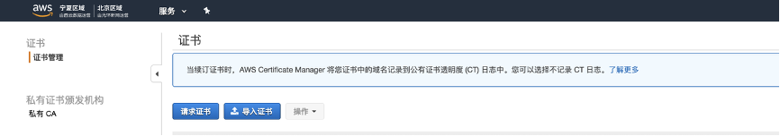

Click the **[Request a certificate]** button.

Select the **[Request a public certificate]** radio box.

Then click the **[Request Certificate]** button.

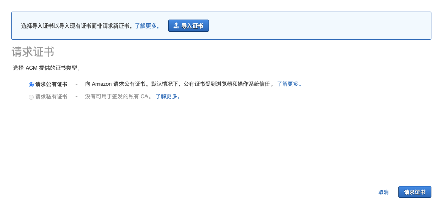

In the **[Add domain name]** input box in **[Add domain name]**, enter the domain name to be used for the Keycloak service.

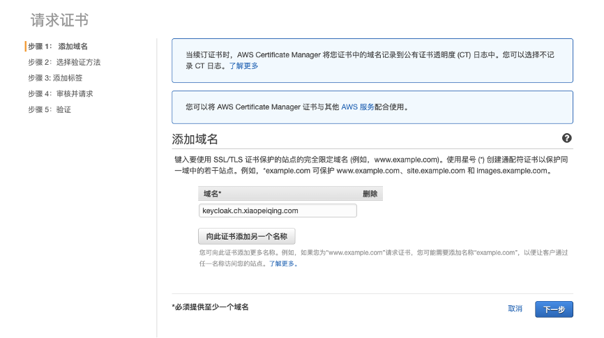

Click **[Next]** .

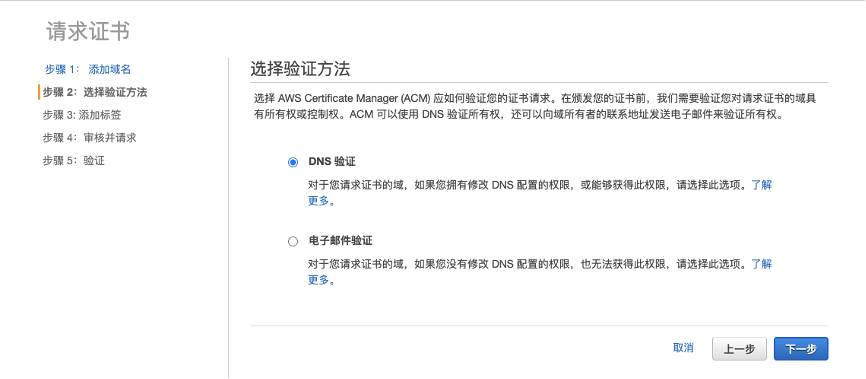

Select **[Verify by DNS]** .

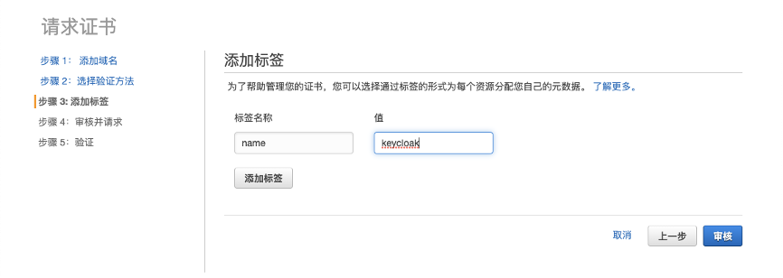

Click the **[Review]** button.

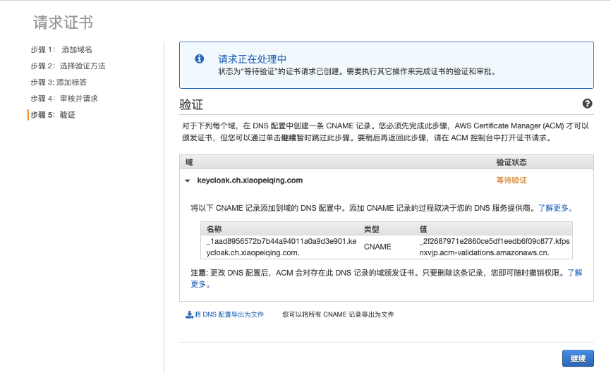

Please record the values of the **[Name]** **[Type]** and **[Value]** fields, which need to be used later in Route53 to add the recordset. Click the **[Continue]** button.

## Authentication Domain

Add a Cname record to Route 53 to authenticate that the domain name is owned and available to you. First, go to the Route 53 administration page and click on your domain name.
If no hosted zone has been created, refer to https://aws.amazon.com/cn/route53/

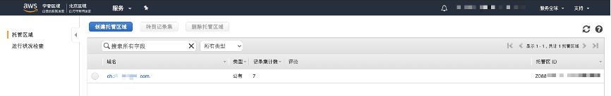

Click **[Create Record Set]** and enter the **[Name]** **[Type]** and **[Value]** fields recorded in the ACM authentication step in the **[Name]** input box on the right window.

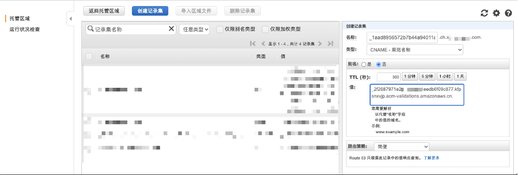

When you are done adding them. Go back to the ACM interface and wait for about 5 minutes. Click the Refresh button. Wait for the status of ACM certificate to change to **[Issued]**.

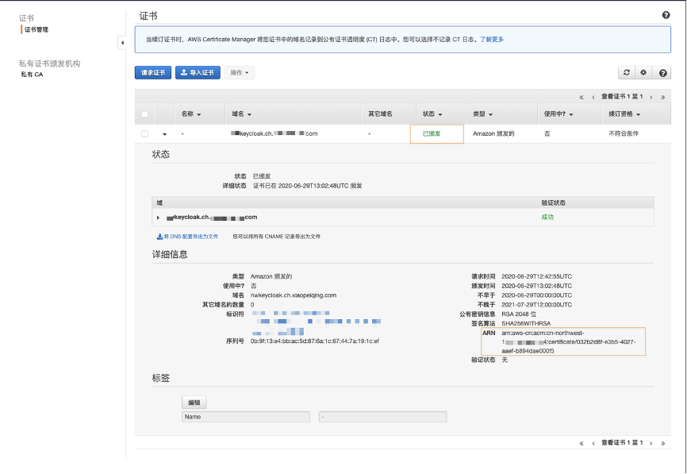

At this point, the ACM certificate has been applied.
Please make a note of the ARN string marked by the orange box in the image above. This value will be used as an input value in Cloudformation. For example.

`arn:aws-cn:acm:cn-northwest-1:12345678901:certificate/032b2d8f-e3b5-4027-aaef-b894dae000f5`

# Rapid Deployment

The steps in this article are focused on deploying the solution while running in an AWS (Ningxia) region operated by NWCD or an AWS (Beijing) region operated by Sinnet. You can quickly start a CloudFormation stack to deploy and manage the entire solution using the following link.

## Start CloudFormation Stack

Click on the Ningxia and Beijing region links to open the AWS Management Console (if you are not already logged in you will first jump to the login page, and after logging in you will be taken to the template launch page). By default, this template is launched in the Ningxia region, but you can also use the region selection link at the top right of the console to deploy the solution in other regions. Then click the button below to launch the AWS CloudFormation template.

| quickstart link                                                                                                                                                                                                                                          | description                                                                    |
| -------------------------------------------------------------------------------------------------------------------------------------------------------------------------------------------------------------------------------------------------------- | ------------------------------------------------------------------------------ |
| [keycloak-aurora-serverless-from-existing-vpc](https://console.aws.amazon.com/cloudformation/home#/stacks/quickcreate?templateUrl=https://aws-gcr-solutions.s3.amazonaws.com/keycloakonaws/latest/keycloak-aurora-serverless-from-existing-vpc.template) | Deploying AuroraServerless from an Existing VPC as a Keycloak for the database |
| [keycloak-aurora-serverless-from-new-vpc](https://console.aws.amazon.com/cloudformation/home#/stacks/quickcreate?templateUrl=https://aws-gcr-solutions.s3.amazonaws.com/keycloakonaws/latest/keycloak-aurora-serverless-from-new-vpc.template)           | New VPC Deployment AuroraServerless for database Keycloak                      |
| [keycloak-from-existing-vpc](https://console.aws.amazon.com/cloudformation/home#/stacks/quickcreate?templateUrl=https://aws-gcr-solutions.s3.amazonaws.com/keycloakonaws/latest/keycloak-from-existing-vpc.template)                                     | Deploying RDS MySQL from an existing VPC as the Keycloak for the database      |
| [keycloak-from-new-vpc](https://console.aws.amazon.com/cloudformation/home#/stacks/quickcreate?templateUrl=https://aws-gcr-solutions.s3.amazonaws.com/keycloakonaws/latest/keycloak-from-new-vpc.template)                                               | New VPC Deploying RDS MySQL as Keycloak for Database                           |

| template link                                                                                                                                                                       |
| ------------------------------------------------------------------------------------------------------------------------------------------------------------------------------ |
| [keycloak-aurora-serverless-from-existing-vpc.template](https://aws-gcr-solutions.s3.amazonaws.com/keycloakonaws/latest/keycloak-aurora-serverless-from-existing-vpc.template) |
| [keycloak-aurora-serverless-from-new-vpc.template](https://aws-gcr-solutions.s3.amazonaws.com/keycloakonaws/latest/keycloak-aurora-serverless-from-new-vpc.template)           |
| [keycloak-from-existing-vpc.template](https://aws-gcr-solutions.s3.amazonaws.com/keycloakonaws/latest/keycloak-from-existing-vpc.template)                                     |
| [keycloak-from-new-vpc.template](https://aws-gcr-solutions.s3.amazonaws.com/keycloakonaws/latest/keycloak-from-new-vpc.template)                                               |

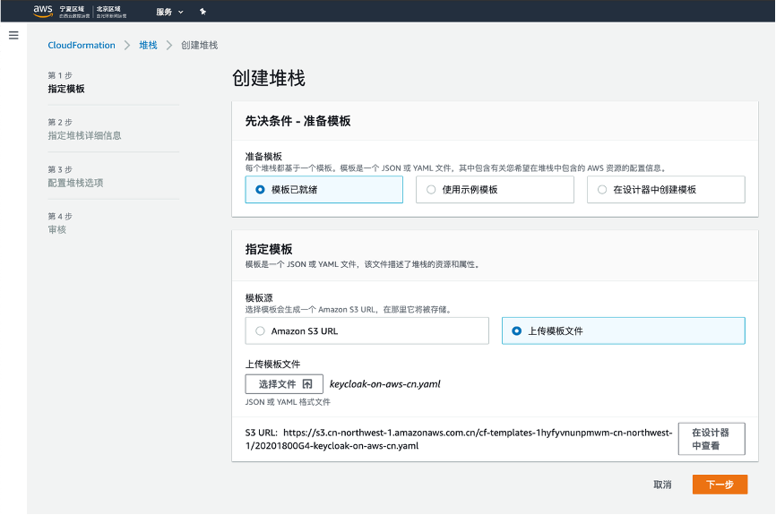

## Specify stack details

| parameter type                     | stack name                      | default value          | usage                                                                               |
| ---------------------------------- | ------------------------------- | ---------------------- | ----------------------------------------------------------------------------------- |
| Application Load Balancer Settings | CertificateArn                  | ARN of ACM certificate | for Https encrypted communication                                                   |
| VPC Settings                       | VpcId                           |                        | Select from existing VPCs                                                           |
| VPC Settings                       | PubSubnets                      |                        | Select public subnets for ALB deployment                                            |
| VPC Settings                       | PrivSubnets                     |                        | Select the private subnet for the ECS Task                                          |
| VPC Settings                       | DBSubnets                       |                        | select the private subnet for the RDS database                                      |
| Database                           | DatabaseInstanceType            | r5.large               | Select the RDS instance type                                                        |
| AutoScaling Settings               | MinContainers                   | 2                      | Customize the minimum number of containers for the ECS, with a minimum value of 2   |
| AutoScaling Settings               | MaxContainers                   | 10                     | Customize the maximum number of containers for the ECS, with a maximum value of 10  |
| AutoScaling Settings               | AutoScalingTargetCpuUtilization | 75                     | The percentage of resource utilization that is ensured to be no higher, maximum 100 |

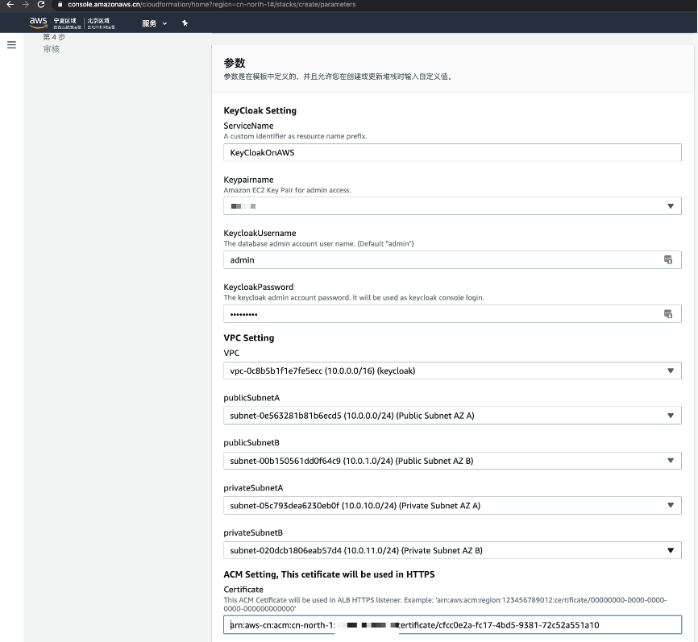

Click **[Next]**

## Configure stack options

Keep the default values

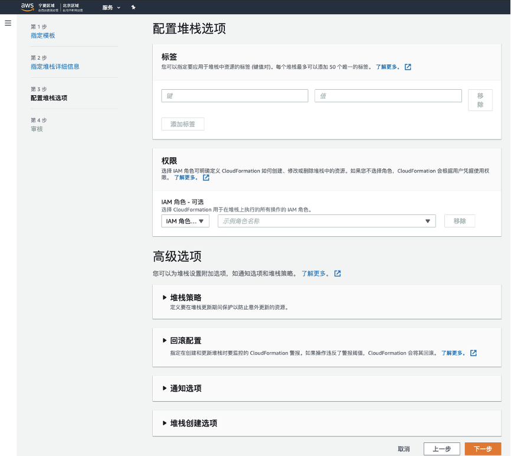

Click **[Next]**

## Review the stack

Leave the defaults as they are, but please check the radio box **I confirm that AWS CloudFormation may create IAM resources with custom names**.

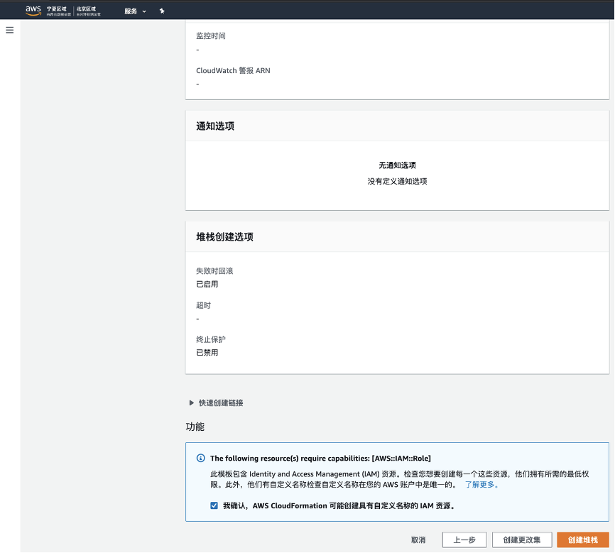

Click **[Create Stack]**.

Wait about 30 minutes for the stack to be created. Click on the **[Output]** tab of the stack.

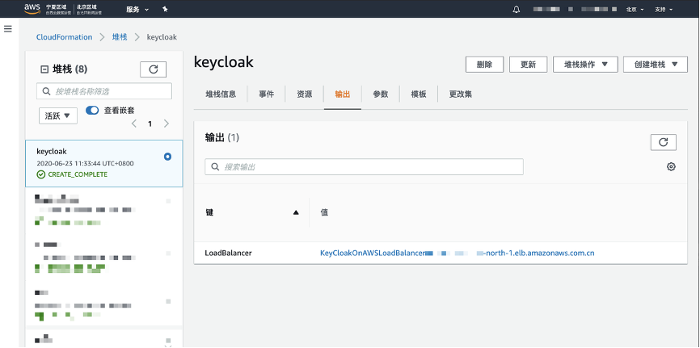

Get the load balancing URL, for example `KeycloakOnAWSLoadBalancer-1059503657.cn-north-1.elb.amazonaws.com.cn`.

## Create a recordset in Route53 for resolving the domain name

Go to the administration interface of Route53 and click the **[Create Recordset]** button.

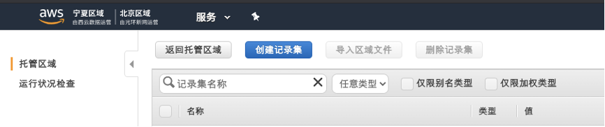

Fill in the following information.

- **Name**: Fill in the second-level domain name required by Keycloak, with the default suffix being the first-level domain name filed with ICP, e.g. Keycloak.ch.test.com
- **Alternate Name**: Select the "Yes" radio box button
- **Alternate Target**: Select the URL of the load balancing created by Keycloak on AWS in the previous step.

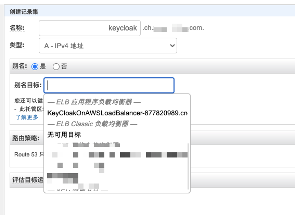

Click the **[Create]** button.

At this point, Keycloak on AWS can provide services to the public using the domain name and HTTPS.

# Using Keycloak

Enter **https://你的域名** in the address bar of your browser, as defined above `Keycloak.ch.test.com`.
Since this guide uses a certificate requested by ACM, the certificate authority seen is Amazon.

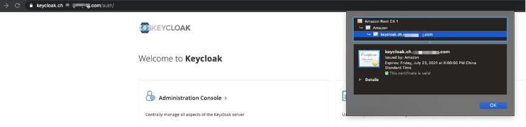

Then click on the **Administration Console** link.

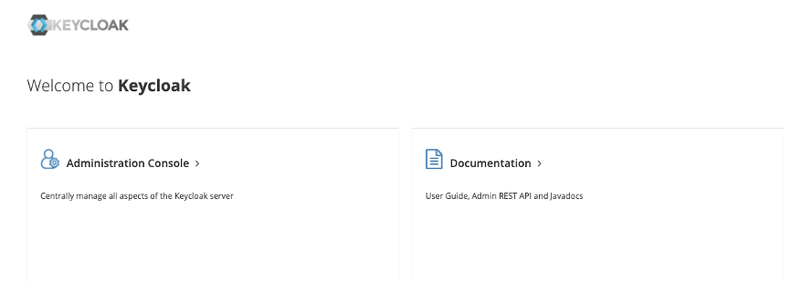

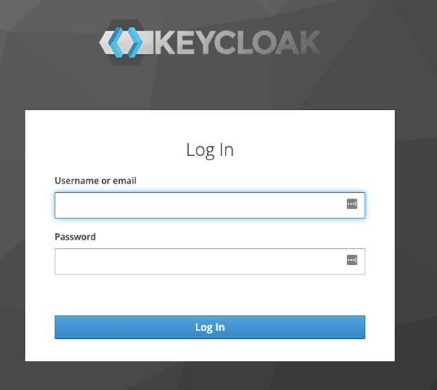

Enter the KeyCloak administrator username and password, the initial username and password will be automatically generated in the AWS Secrets Manager

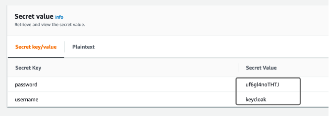

## Create a new Realm

Click on the drop-down list to the right of Master and click **[Add realm]**

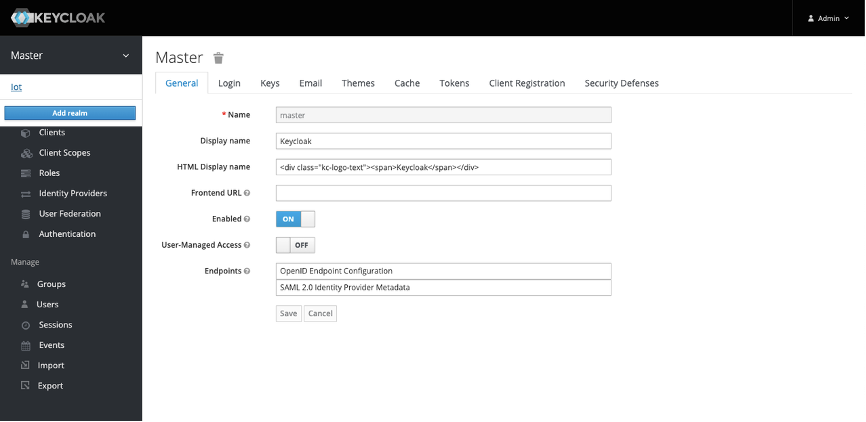

Enter a Name, e.g. iotrealm, and click the **[Create]** button

In the **[General]** tab, enter a custom "iotrealm" in the Display Name and HTML Display name input box, and click the **[Save]** button.

Click the **[Save]** button. 

## Create a new Client

Select **[Clients]** on the left side of the panel

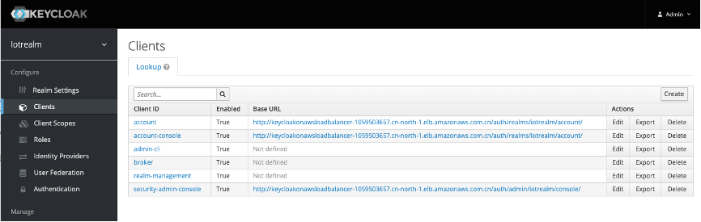

Click the **[Create]** button, enter "iotreleamclient" in the Client ID input box as an example, select "openid-connect" for the Client Protocal, and click the **[Save]** button.

Click the **[Create]** button, enter "iotreleamclient" in the Client ID input box as an example, select "openid-connect" for Client Protocal, and click the **[Save]** button.

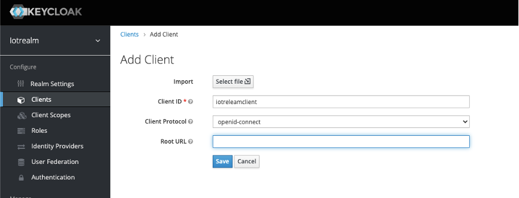

Enter the [Clients] details page on the panel.

- **Access Type** Select `confidential` type.
- **Valid Redirect URIs** Enter `https://localhost/login` or your own application URL as the callback URL, make sure the URL string starts with `https` or `http`.

Click the **[Save]** button.

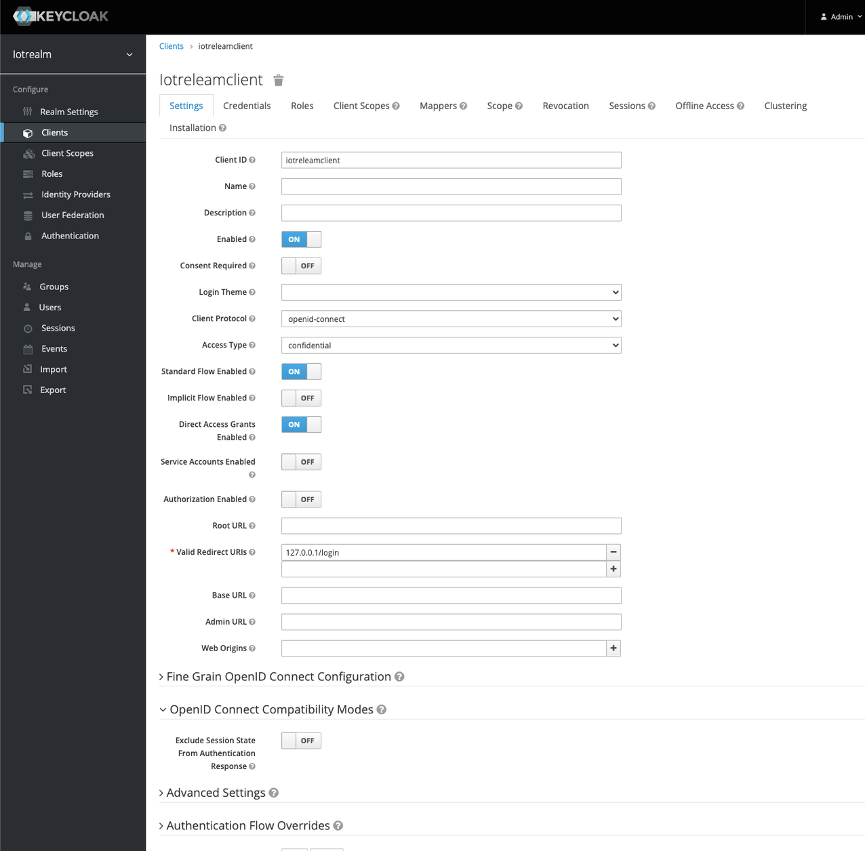

## Get the Client's Secret in Keycloak Realm

Select **[Clients]** on the left side of Keycloak → click **[Credentials]** tab on the right side.

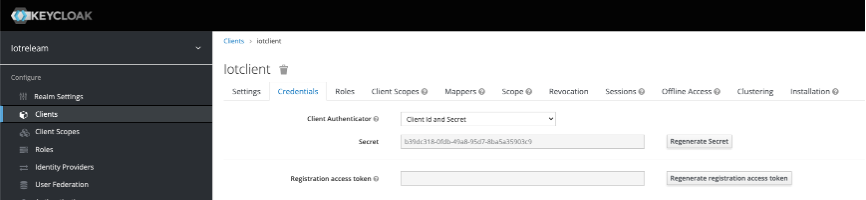

Record the value in the Secret field.

## Create Keycloak Client Users

Select **[Manager]** → **[Users]** on the left side of Keycloak.

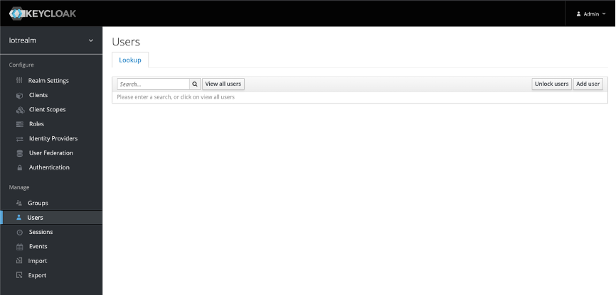

Click the **[Add user]** button. The test information is shown below, click the **[Save]** button.

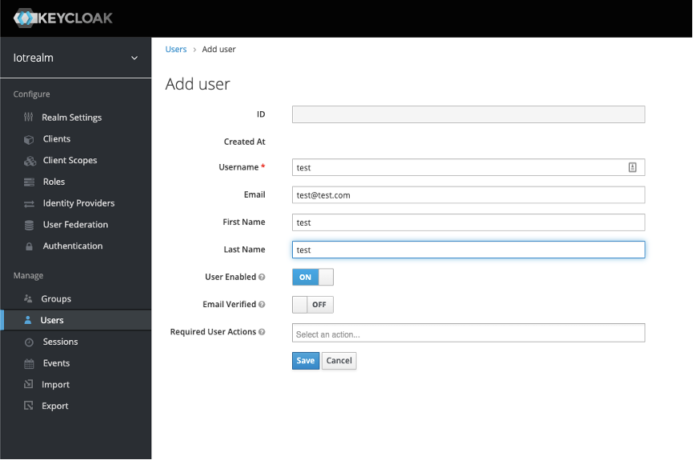

After saving, go to **[User]** → **[Test]** → **[Credential]** tab.

- Password input "test"
- Password confirmation Enter "test"
- Temporary Select "OFF"

Click **[Set Password]** button.

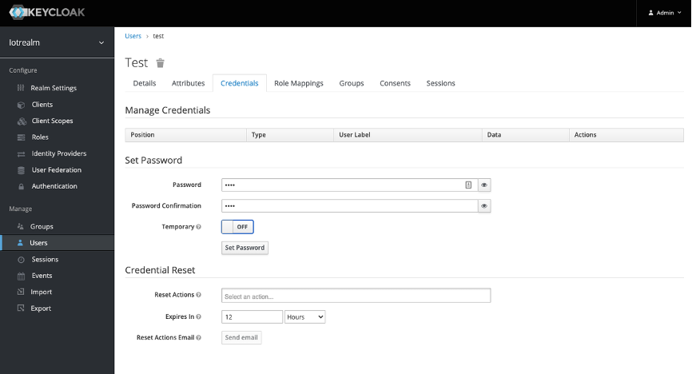

## Get OpenID Endpoint

Get the OpenID Endpoint Configuration for this realm.
Click on **[Realm Settings]** and select the **[General]** tab. Click on the **[OpenID Endpoint Configuration]** link in Endpoints.

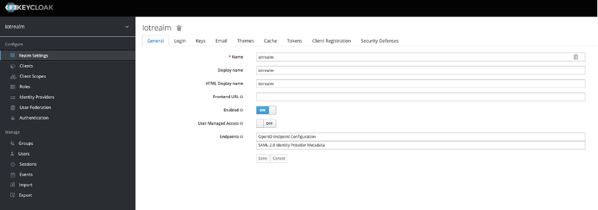

When clicked, the system returns the following json string.

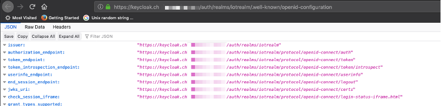

Please record the corresponding value of the issue field. For example `https://Keycloak.ch.test.com/auth/realms/iotrealm`

Setting up the IAM OpenID Provider

Create an OpenID Provider in IAM.

Go to the IAM Console and click **[Identity Provider]**

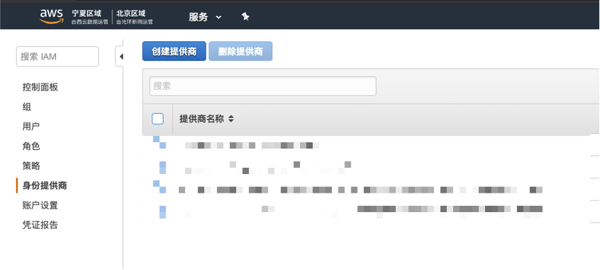

Click the **[Create Provider]** button.

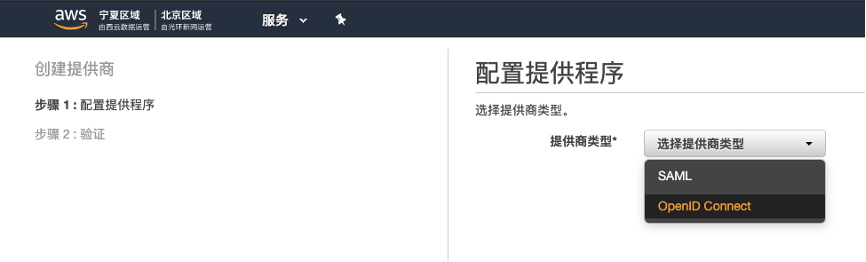

Select the OpenID Connect option.

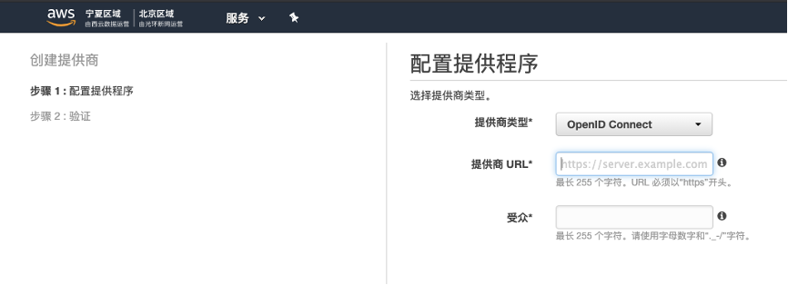

Provider URL Enter the domain name and realm information to which Keycloak is bound. For example, `https://Keycloak.ch.test.com/auth/realms/iotreleam`. Note: Please make sure to use https method, otherwise it will not be added.

**[Audience]** Add the name of the Client created in Keycloak, e.g. `iotrealmclient`.

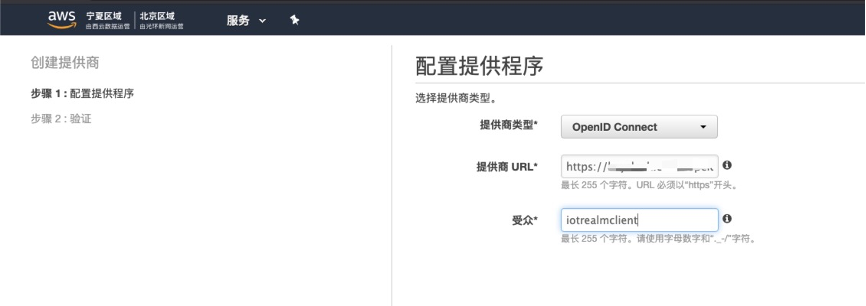

Click **[Next]** to confirm the provider information. Click on the **[Create]** button.

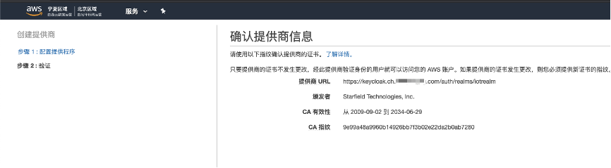

## Set up the Cognito Identity Pool

### Create Cognito Identity pool

Go to the Cognito console and click **[Create New Identity Pool]**.

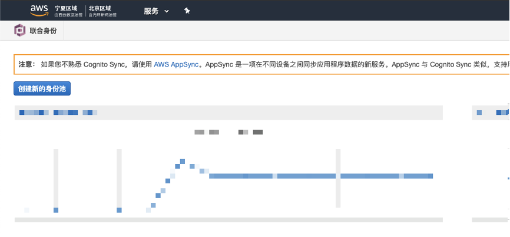

Enter a custom identity pool name e.g. `Keycloak_identity_pool`.

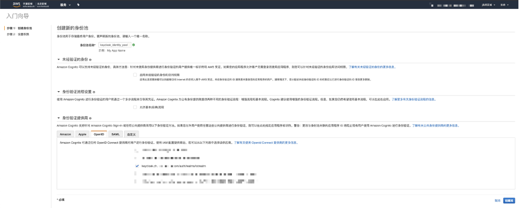

Click the **[Allow]** button

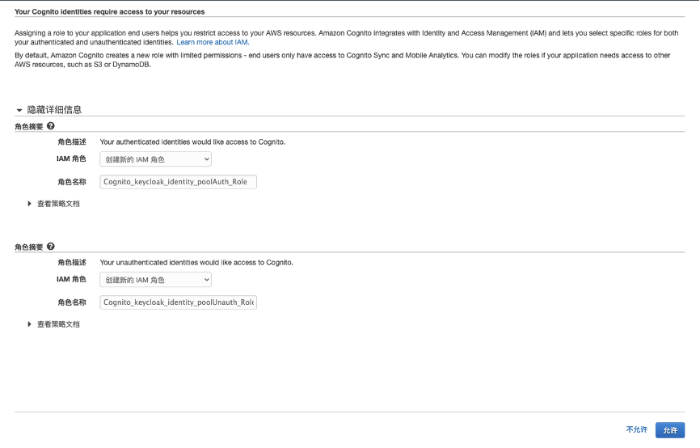

### Get Cognito Identity Pool ID

Go to the created Cognito Identity Pool interface, click **[Edit Identity Pool]** in the top right corner

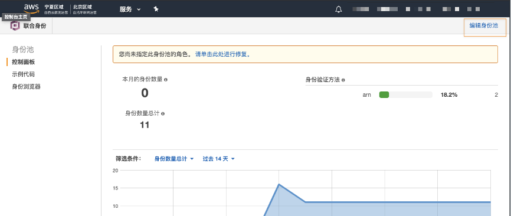

Record the Identity Pool ID. Example: `cn-north-1:xxxxxxxxxxxx-8c7e-0d81205852ca`

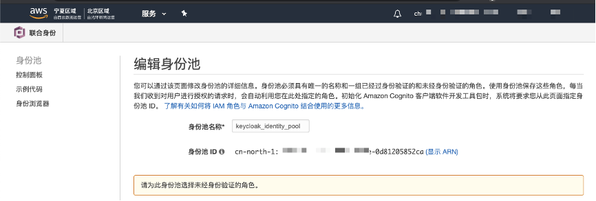

### About how to modify the IAM Role

When creating a Cognito Identity Pool, you need to specify two roles (Role), one is the **[Role]** that logged-in users have and the other is the **[Role]** that non-logged-in users have. If you have not set up either of these Roles, please create them in the IAM console. For more information on how to create a Role and related roles, please refer to: https://docs.aws.amazon.com/IAM/latest/UserGuide/id_roles.html

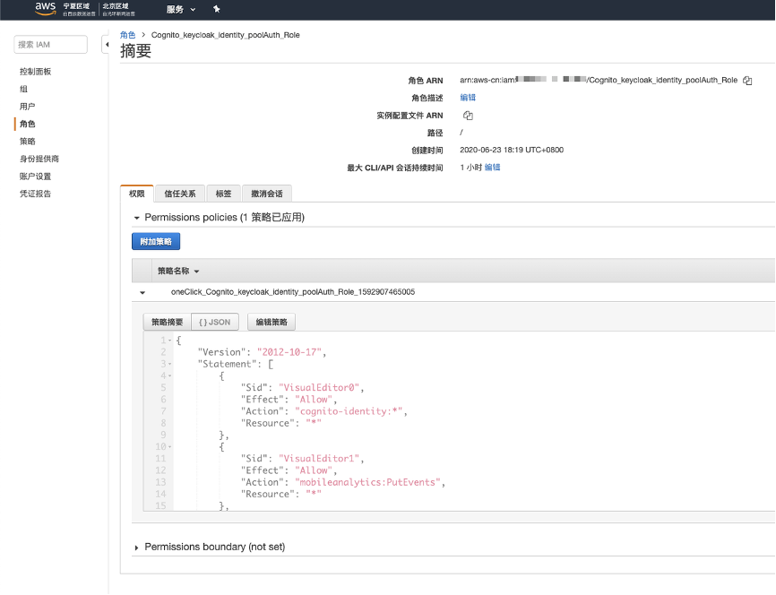

