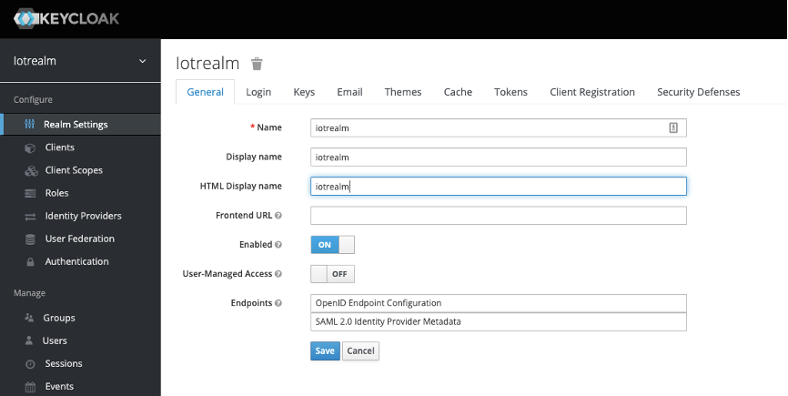

# 背景

本部署指南详细描述了如何在云上使用 AWS CloudFormation 模板部署 Keycloak，从而构建Keycloak on AWS 高可用架构。

# 解决方案描述

Keycloak 的容器在 [AWS Fargate](https://amazonaws-china.com/fargate/) 上部署和运行，借助于 AWS Fargate，您无需预置和管理容器实例。为了确保系统高可用，[Amazon ECS](https://amazonaws-china.com/ecs/) 服务定义了两个任务，如果某一个任务出现故障不能提供服务的情况下，另外的一个任务仍旧能对外提供服务。

另外本解决方案使用 [Amazon RDS](https://amazonaws-china.com/rds/) 作为系统数据库，用于存储 Keycloak的配置及用户信息。为了确保系统的高可用性和信息安全。 默认采用了 [Amazon RDS 多可用区部署方式](https://aws.amazon.com/cn/rds/features/multi-az/) ，数据库在每个可用区中运行，并已设计为具备高可靠性。万一发生基础设施故障，Amazon RDS 可自动故障转移至备用实例中，以便您能够在故障转移结束后立即恢复数据库操作。此外，本解决方案也支持 [Amazon Aurora Serverless](https://aws.amazon.com/cn/rds/aurora/serverless/) 数据库集群的选项，Amazon Aurora Serverless 会根据应用程序的需求自动启动、关闭以及扩展或缩减容量，让您无需管理任何数据库实例，即可在云中运行数据库。

无论选择哪一种数据库类型，缺省的数据库密码会在部署的同时自动产生并且存放在 [AWS Secrets Manager](https://aws.amazon.com/cn/secrets-manager/)。

# 使用场景

此解决方案提供了在AWS 云上构建高可用架构的Keycloak集群。Keycloak 是一款开箱即用的开源身份及访问控制软件，提供了单点登录（SSO）功能，支持OpenID Connect、OAuth 2.0、SAML 2.0标准协议。Keycloak 提供可自定义的用户界面，用于登录，注册，管理和帐户管理。此外，用户可以将Keycloak 与[Amazon Cognito](https://amazonaws-china.com/cognito/)或与其他现有的 LDAP 和 [Azure Active Directory](https://azure.microsoft.com/en-us/services/active-directory/) 服务器进行集成。用户还可以将身份验证委派给第三方身份提供商。

# 系统架构

## 架构图
此解决方案可在由西云数据运营的AWS（宁夏）区域或由光环新网运营的AWS（北京）区域中部署，也可部署在AWS其他海外区域。

## 组件

### Amazon ECS

- 本解决方案使用 AWS Fargate 运行 Amazon ECS 集群，前者是容器的无服务器计算服务。使用 AWS Fargate，您无需预置和管理服务器，而且可以为每个应用程序指定资源并为其付费，并通过设计隔离应用程序来提高安全性。

- 为了确保系统高可用，在Amazon ECS 服务定义了两个任务，如果某一个任务出现故障不能提供服务，另外的一个任务仍旧能继续提供服务。

- Amazon ECS 支持 Docker 并使您能够运行和管理 Docker 容器。 Keycloak的容器镜像在 Amazon ECS 上部署和运行，无需进行任何配置更改。

### Amazon ECR

- 用于存储 Keycloak 的 Docker 镜像文件。
### Amazon Certificate Manager (ACM)
- 用于 ALB 的 Https 侦听器（TLS：443）中 SSL Certificate。

### Amazon Identity and Access Management (IAM)

- Cognito Identity pool联合 Keycloak进行用户验证。其可以有两种 Role,一种是未登录用户所有拥有的 Role,一种是已经登录的用户所拥有的 Role。根据Role 所拥有的不同 Policy，用户可以访问不同的 AWS 服务。

### Amazon Route 53

- 用于域名解析及 ACM 证书创建时验证。
### Amazon RDS

- 数据库类型是Amazon RDS for MySQL。
- 默认数据库实例类型是 db.r5.large。
- 默认使用 Amazon RDS 多可用区部署。
- 默认自动备份 7 天。
- 默认启用 KMS 加密。
- 可选择使用Amazon Aurora Serverless
- 可选择使用单独一个Amazon RDS实例

### AWS Secrets Manager
- 自动产生与存储 Keycloak 的 管理员账户初始用户名与密码
- 自动产生与存储 数据库的 管理员账户初始用户名、密码与连接域名与端口等资讯

# 部署说明

## 部署前提

1. 已经经过 ICP 备案的域名，用于申请ACM证书。
2. 在 ACM中创建该域名的证书，并通过域名验证。
3. 具有 4 个子网（包含两个公有子网，两个私有子网）及 NAT Gateway的 VPC。

## 创建 ACM 证书

为了能确保 Keycloak 可以同 Cognito Identity pool 连接，必须确保 Keycloak 提供在 HTTPS 服务。这也就是说必须使用 ACM 证书或者第三方的证书。具体使用方式，请参考：
[如何上传 SSL 证书并将其导入 AWS Identity and Access Management (IAM)](https://aws.amazon.com/cn/premiumsupport/knowledge-center/import-ssl-certificate-to-iam/)

本部署指南以使用 AWS Certificate Manager (ACM) 为例进行说明。关于 ACM 更多信息，请参考 https://aws.amazon.com/cn/certificate-manager/

首先，登录 ACM 控制台。

点击 **【请求证书】** 按钮。

选择 **【请求公有证书】** 单选框。

然后点击 **【请求证书】** 按钮。

在 **【添加域名】** 中的 **【域名】** 输入框，输入 Keycloak 服务所需要使用的域名。

点击 **【下一步】** 。

选择 **【DNS方式验证】** 。

点击 **【审核】** 按钮。

请记录下 **【名称】** **【类型】** 及 **【值】** 三个字段的值，这三个值需要在后面的 Route53 中添加记录集使用。点击 **【继续】** 按钮。

## 认证域名

在 Route 53中添加 Cname 记录，以认证该域名为您所有并可以使用。首先，进入 Route 53的管理页面，点击你的域名。
如果没有创建托管区域，请参考 https://aws.amazon.com/cn/route53/

点击 **【创建记录集】**，在右侧的窗口 **【名称】** 输入框输入在 ACM 验证步骤中记录的 **【名称】** **【类型】** 及 **【值】** 三个字段。

添加完成后。回到ACM 界面等待大概5 分钟。点击刷新按钮。等待 ACM 证书的状态变为 **【已颁发】** 。

到此为止，ACM证书已经申请完毕。
请记下上图橙色方框所标记的 ARN字符串。该值将用于在 Cloudformation 中作为输入值。例如：

`arn:aws-cn:acm:cn-northwest-1:12345678901:certificate/032b2d8f-e3b5-4027-aaef-b894dae000f5`

# 快速部署

本文的步骤主要针对在运行在由西云数据运营的AWS（宁夏）区域或由光环新网运营的AWS（北京）区域中部署该解决方案，您可以使用以下链接快速启动一个CloudFormation堆栈来部署和管理整个方案：

## 启动CloudFormation堆栈

点击宁夏和北京区域链接，打开AWS管理控制台（如果还没登录会先跳转到登录页面，登录后进入模板启动页面）。默认情况下，此模板在宁夏区域启动，您同时可以使用控制台右上方的区域选择链接，以在其他区域部署该方案。然后单击下面的按钮以启动 AWS CloudFormation 模板。

| 快速启动链接                                                                                                                                                                                                                                             | 描述                                                 |
| -------------------------------------------------------------------------------------------------------------------------------------------------------------------------------------------------------------------------------------------------------- | ---------------------------------------------------- |
| [keycloak-aurora-serverless-from-existing-vpc](https://console.aws.amazon.com/cloudformation/home#/stacks/quickcreate?templateUrl=https://aws-gcr-solutions.s3.amazonaws.com/keycloakonaws/latest/keycloak-aurora-serverless-from-existing-vpc.template) | 从既有 VPC 部署 AuroraServerless 为数据库的 Keycloak |
| [keycloak-aurora-serverless-from-new-vpc](https://console.aws.amazon.com/cloudformation/home#/stacks/quickcreate?templateUrl=https://aws-gcr-solutions.s3.amazonaws.com/keycloakonaws/latest/keycloak-aurora-serverless-from-new-vpc.template)           | 新建 VPC 部署 AuroraServerless 为数据库的 Keycloak   |
| [keycloak-from-existing-vpc](https://console.aws.amazon.com/cloudformation/home#/stacks/quickcreate?templateUrl=https://aws-gcr-solutions.s3.amazonaws.com/keycloakonaws/latest/keycloak-from-existing-vpc.template)                                     | 从既有 VPC 部署 RDS MySQL 为数据库的 Keycloak        |
| [keycloak-from-new-vpc](https://console.aws.amazon.com/cloudformation/home#/stacks/quickcreate?templateUrl=https://aws-gcr-solutions.s3.amazonaws.com/keycloakonaws/latest/keycloak-from-new-vpc.template)                                               | 新建 VPC 部署 RDS MySQL 为数据库的 Keycloak          |

| 模版链接                                                                                                                                                                       |
| ------------------------------------------------------------------------------------------------------------------------------------------------------------------------------ |
| [keycloak-aurora-serverless-from-existing-vpc.template](https://aws-gcr-solutions.s3.amazonaws.com/keycloakonaws/latest/keycloak-aurora-serverless-from-existing-vpc.template) |
| [keycloak-aurora-serverless-from-new-vpc.template](https://aws-gcr-solutions.s3.amazonaws.com/keycloakonaws/latest/keycloak-aurora-serverless-from-new-vpc.template)           |
| [keycloak-from-existing-vpc.template](https://aws-gcr-solutions.s3.amazonaws.com/keycloakonaws/latest/keycloak-from-existing-vpc.template)                                     |
| [keycloak-from-new-vpc.template](https://aws-gcr-solutions.s3.amazonaws.com/keycloakonaws/latest/keycloak-from-new-vpc.template)                                               |

## 指定堆栈详细信息

| 参数类型 | 堆栈名称 | 值 | 用途 |
|---------|--------|----|-----|
|Application Load Balancer Settings|CertificateArn| ACM 证书的ARN |用于 Https 加密通讯|
|VPC Settings|VpcId| |从现有的 VPC 中进行选择|
|VPC Settings|PubSubnets| |选择公有子网，用于部署 ALB|
|VPC Settings|PrivSubnets| |择私有子网，用于放置 ECS Task|
|VPC Settings|DBSubnets| |择私有子网，用于放置 RDS 数据库|
|Database|DatabaseInstanceType| r5.large |选择RDS 的实例类型|
|AutoScaling Settings|MinContainers| 2 |自定义ECS的最少容器数量，最小值为2|
|AutoScaling Settings|MaxContainers| 10 |自定义ECS的最大容器数量，最大值为10|
|AutoScaling Settings|AutoScalingTargetCpuUtilization| 75 |确保资源利用率不高于的百分比，最大值100|

点击 **【下一步】**

## 配置堆栈选项

保持默认值

点击 **【下一步】**

## 审核堆栈

保持默认值，但请勾选  **我确认，AWS CloudFormation 可能创建具有自定义名称的 IAM 资源** 的单选框。

点击  **【创建堆栈】** 。

等待大概 30 分钟，堆栈创建完成。点击堆栈的 **【输出】** 标签页。

得到负载均衡的 URL, 例如 `KeycloakOnAWSLoadBalancer-1059503657.cn-north-1.elb.amazonaws.com.cn`。

## 在 Route53创建记录集用于解析域名

进入 Route53 的管理界面，点击 **【创建记录集】** 按钮。

填入如下信息：

- **名称**：填入Keycloak所需要的二级域名，后缀默认为ICP备案的一级域名，例如 Keycloak.ch.test.com
- **别名**：选择 “是” 单选框按钮
- **别名目标**：选择 Keycloak on AWS 在上一步所创建的负载均衡的 URL。

点击 **【创建】** 按钮。

至此，Keycloak on AWS 可以使用域名及 HTTPS的方式对外提供服务。

# 使用 Keycloak

在浏览器的地址栏输入 **https://你的域名** , 如上面定义的 `Keycloak.ch.test.com`。
由于本指南使用 ACM 申请的证书，所以看到的证书颁发机构是 Amazon。

然后点击 **Administration Console** 的链接。

输入KeyCloak管理员用户名与密码，初始的用户名与密码会自动产生在AWS Secrets Manager当中

## 创建新的 Realm

点击 Master 右边的下拉列表，点击 **【Add realm】**

输入 Name, 例如 iotrealm, 点击 **【Create】** 按钮

在 **【General】** 标签页， Display Name 及 HTML Display name 输入框中输入自定义的 “iotrealm”, 点击 **【Save】** 按钮。

## 创建新的 Client

选择面板左侧的 **【Clients】**

点击  **【Create】** 按钮, Client ID 输入框输入 “iotreleamclient” 作为示例, Client Protocal 选择 “openid-connect”,点击 **【Save】** 按钮。

点击 **【Create】** 按钮, Client ID 输入框输入 “iotreleamclient” 作为示例, Client Protocal 选择 “openid-connect”,点击 **【Save】** 按钮。

进入面板上【Clients】详情页面。

- **Access Type** 选择 `confidential` 类型。
- **Valid Redirect URIs** 输入 `https://localhost/login` 或者您自己的应用URL 作为回调 URL，当请确保 URL 字符串以 `https` 或 `http` 为开始。

点击 **【Save】** 按钮。

## 获得 Keycloak Realm 中 Client 的 Secret

选择 Keycloak 左侧的 **【Clients】** → 点击右侧的 **【Credentials】** 标签页。

记录下 Secret 字段中的值。

## 创建 Keycloak Client Users

选择 Keycloak 左侧的 **【Manager】** → **【Users】**

点击 **【Add user】** 按钮。测试信息如下图所示，点击 **【Save】** 按钮。

保存后，进入 **【User】** → **【Test】** → **【Credential】** 标签页。

- Password 输入 “test”
- Password confirmation 输入 “test”
- Temporary 选择 “OFF”

点击  **【Set Password】** 按钮。

## 获得 OpenID Endpoint

获得该realm的 OpenID Endpoint Configuration。
点击  **【Realm Settings】**，选择 **【General】** 标签页。点击 Endpoints 中的 **【OpenID Endpoint Configuration】** 链接。

点击后，系统返回如下 json 字符串。

请记录下 issue 字段对应值。例如 `https://Keycloak.ch.test.com/auth/realms/iotrealm`

设置 IAM OpenID Provider

在 IAM 创建 OpenID Provider。

进入 IAM Console，点击  **【身份提供商】**

点击 **【创建供应商】** 按钮。

选择 OpenID Connect 选项。

提供商 URL 输入 Keycloak 所绑定的 域名及 realm 信息。例如 `https://Keycloak.ch.test.com/auth/realms/iotreleam`，注意: 请务必确保使用 https 方式，否则无法添加。

**【受众】** 添加Keycloak 中创建的 Client 名称，例如 `iotrealmclient`

点击 **【下一步】**，确认供应商信息。点击 **【创建】** 按钮。

## 设置Cognito Identity Pool

### 创建 Cognito Identity pool

进入Cognito控制台，点击 **【创建新的身份池】**。

输入自定义的身份池名称 例如 `Keycloak_identity_pool`。

点击 **【允许】** 按钮

### 获得 Cognito Identity Pool ID

进入创建好的 Cognito Identity Pool 界面, 点击右上角的 **【编辑身份池】**

记录下身份池 ID. 例如： `cn-north-1:xxxxxxxxxxx-8c7e-0d81205852ca`

### 关于如何修改 IAM Role

当创建 Cognito Identity Pool 时，需要指定两种角色（Role），一种是已登录的用户所具有的 **【角色】** ,另外一种是未登录用户具有的 **【角色】**。如果您没有设置这两种Role，请在IAM控制台创建。有关如何创建Role和相关角色，请参照：https://docs.aws.amazon.com/IAM/latest/UserGuide/id_roles.html

