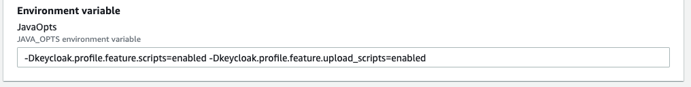
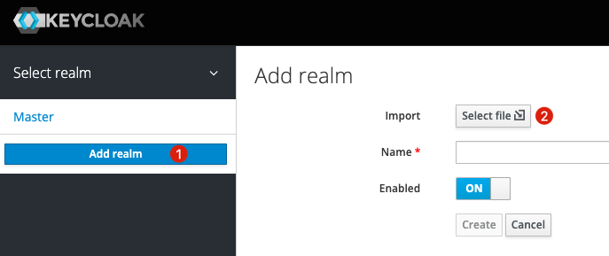
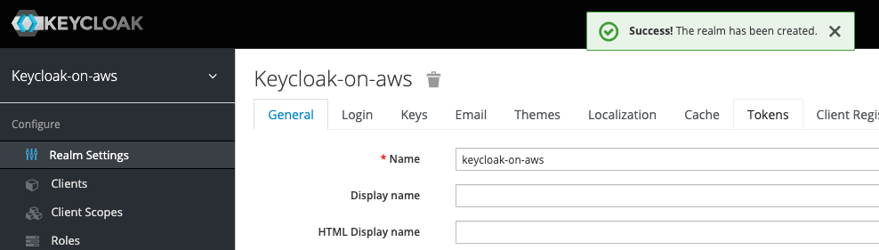
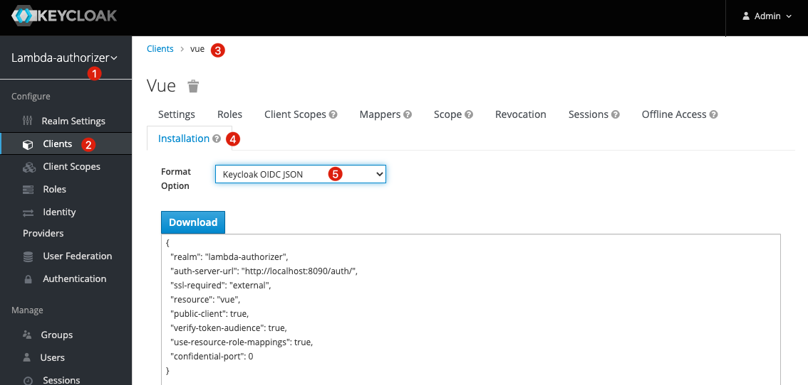
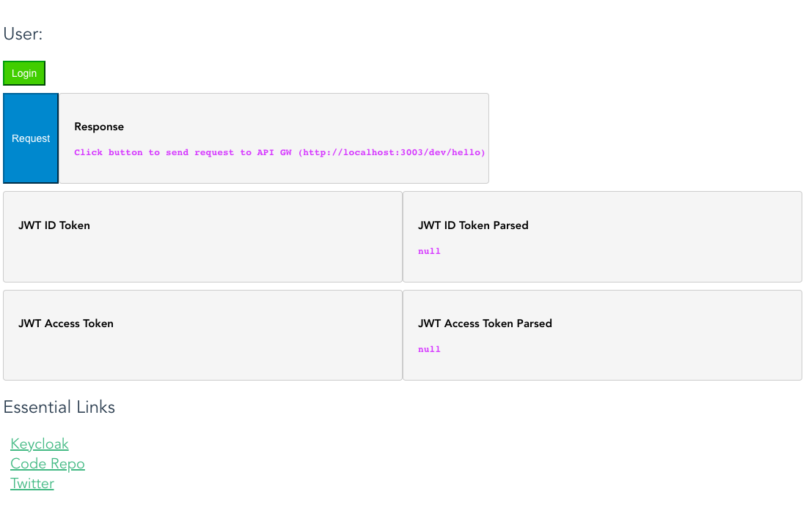
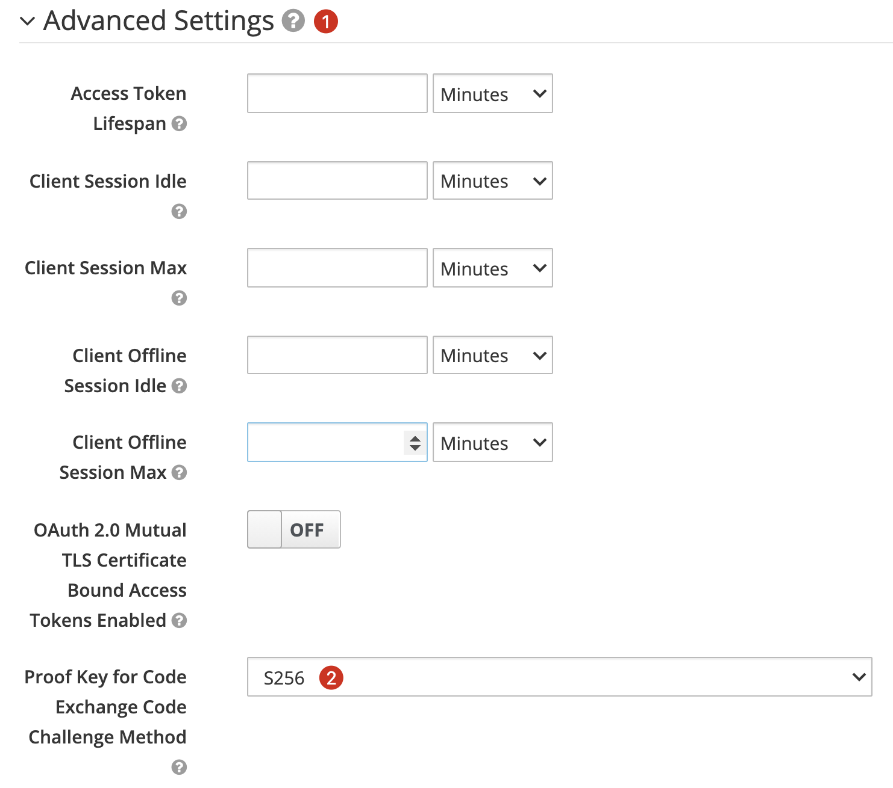
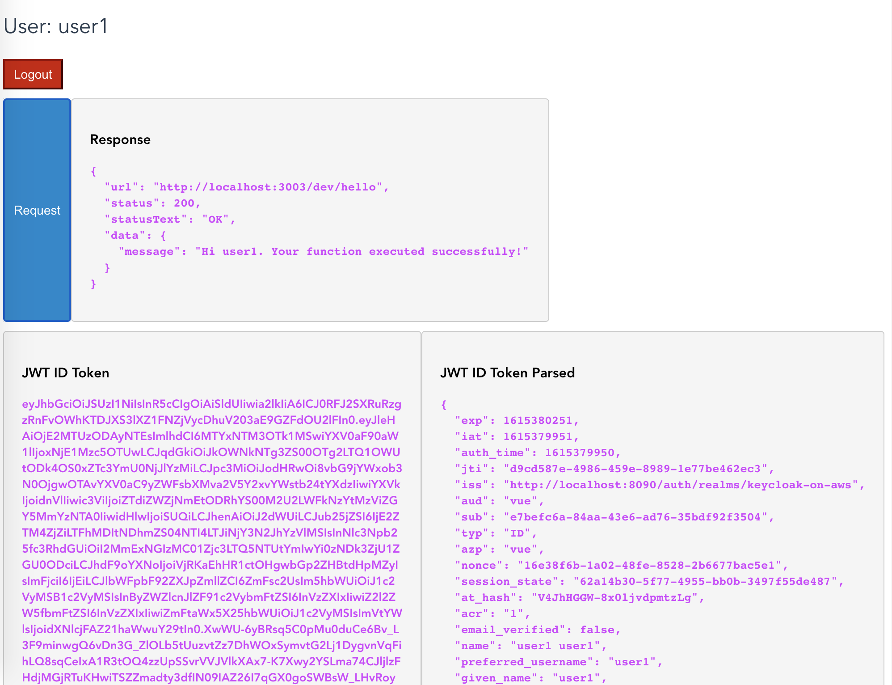
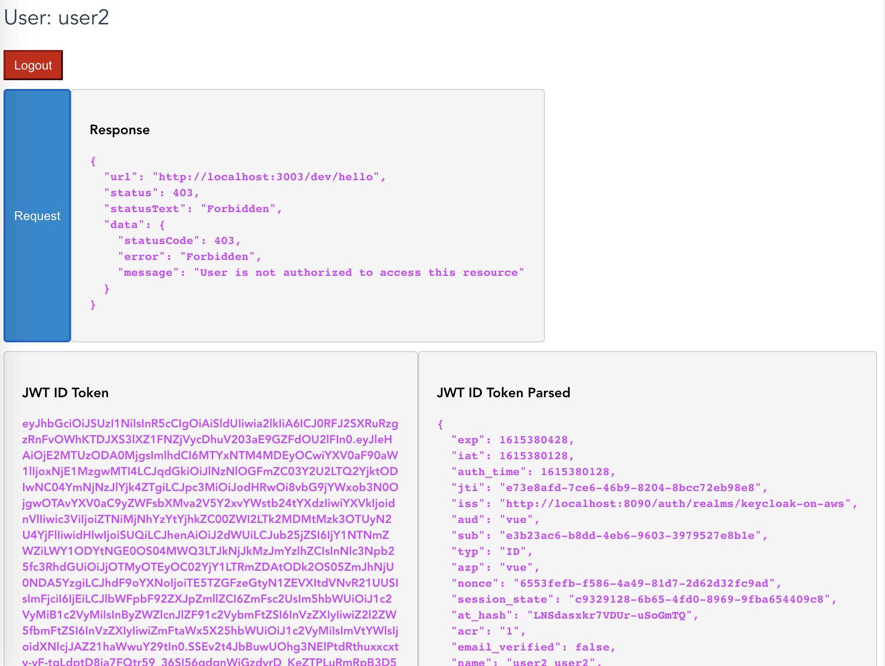
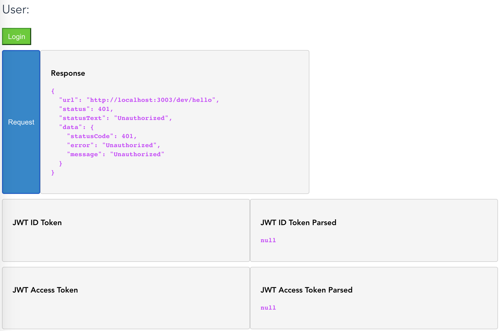

# Keycloak Amazon API Gateway Integration

## Architecture Diagram


## 1. Start Keycloak

1. Deploy anyone of the stack based on your need by following [this guide](./../../doc/DEPLOYMENT_GUIDE.md) - "Start CloudFormation Stack" section on AWS.

2. Make sure your have the following `JAVA_OPTS` filled in CloudFormation parameter.

    ```
    -Dkeycloak.profile.feature.scripts=enabled -Dkeycloak.profile.feature.upload_scripts=enabled
    ```

    

3. Once your CloudFormation stack is ready. Import the Keycloak example config from `examples/api-gw/realm-export.json`

    

    


## 2. Run Custom Authorizer locally

This example provide custom authorizer in different ways:

1. [serverless-express-auth](./serverless-express-auth/package.json)

    This example is mainly based on [expressjs](https://github.com/expressjs/express) and official [keycloak-nodejs-connect](https://github.com/keycloak/keycloak-nodejs-connect). And using [serverless-express](https://github.com/vendia/serverless-express/) to make `expressjs` be able to run on lambda.

    The advantage of this way is, `keycloak-nodejs-connect` is maintained by keycloak team and it is the recommended way to connect to keycloak.

    > Notice: The document of `keycloak-nodejs-connect` is at https://www.keycloak.org/docs/latest/securing_apps/#_nodejs_adapter

    ### Instructions

    Update `examples/api-gw/resources/keycloak.json` according to keycloak client installation config. Go to `keycloak-on-aws` realm => `clients` tab => `vue` client => `installation` tab => format option: `keycloak oidc json`.

    

    ```json
    {
        "realm": "keycloak-on-aws",
        "auth-server-url": "<YOUR AUTH SERVER URL>",
        "ssl-required": "external",
        "resource": "vue",
        "public-client": true,
        "confidential-port": 0,
        // Don't remove the following line, this is for vue-ui to contact to api gw !!!
        "x-api-gw-url": "http://localhost:3003/dev/hello"
    }
    ```

    After that

    ```shell
    $ cd examples/api-gw/serverless-express-auth/
    $ yarn
    $ yarn offline
    ```

    Sample output

    ```
    ...
    offline: Offline [http for lambda] listening on http://0.0.0.0:3019
    offline: Function names exposed for local invocation by aws-sdk:
            * authEndpoint: serverless-express-auth-dev-authEndpoint
            * hello: serverless-express-auth-dev-hello
    [offline] Lambda Invocation Routes (for AWS SDK or AWS CLI):
            * POST http://0.0.0.0:3019/2015-03-31/functions/serverless-express-auth-dev-authEndpoint/invocations
            * POST http://0.0.0.0:3019/2015-03-31/functions/serverless-express-auth-dev-hello/invocations
    [offline] Lambda Async Invocation Routes (for AWS SDK or AWS CLI):
            * POST http://0.0.0.0:3019/2014-11-13/functions/serverless-express-auth-dev-authEndpoint/invoke-async/
            * POST http://0.0.0.0:3019/2014-11-13/functions/serverless-express-auth-dev-hello/invoke-async/
    offline: Configuring Authorization: hello authEndpoint
    [offline] Creating Authorization scheme for hello-authEndpoint-GET-hello

    ┌───────────────────────────────────────────────────────────────────────┐
    │                                                                       │
    │   GET | http://0.0.0.0:3003/dev/hello                                 │
    │   POST | http://0.0.0.0:3003/2015-03-31/functions/hello/invocations   │
    │                                                                       │
    └───────────────────────────────────────────────────────────────────────┘

    offline: [HTTP] server ready: http://0.0.0.0:3003 🚀
    offline:
    offline: Enter "rp" to replay the last request
    ```

2. [serverless-lambda-auth](./serverless-lambda-auth/package.json)

    This example is mainly based on [keycloak-lambda-authorizer](https://github.com/vzakharchenko/keycloak-lambda-authorizer).

    ### Instructions

    The same as `serverless-express-auth`

    After that

    ```shell
    $ cd examples/api-gw/serverless-lambda-auth/
    $ yarn
    $ yarn offline
    ```

    Sample Output

    ```
    ...
    Build completed in 4.971s

    offline: Offline [http for lambda] listening on http://0.0.0.0:3019
    offline: Function names exposed for local invocation by aws-sdk:
            * authEndpoint: serverless-lambda-auth-dev-authEndpoint
            * hello: serverless-lambda-auth-dev-hello
    [offline] Lambda Invocation Routes (for AWS SDK or AWS CLI):
            * POST http://0.0.0.0:3019/2015-03-31/functions/serverless-lambda-auth-dev-authEndpoint/invocations
            * POST http://0.0.0.0:3019/2015-03-31/functions/serverless-lambda-auth-dev-hello/invocations
    [offline] Lambda Async Invocation Routes (for AWS SDK or AWS CLI):
            * POST http://0.0.0.0:3019/2014-11-13/functions/serverless-lambda-auth-dev-authEndpoint/invoke-async/
            * POST http://0.0.0.0:3019/2014-11-13/functions/serverless-lambda-auth-dev-hello/invoke-async/
    offline: Configuring Authorization: hello authEndpoint
    [offline] Creating Authorization scheme for hello-authEndpoint-GET-hello

    ┌───────────────────────────────────────────────────────────────────────┐
    │                                                                       │
    │   GET | http://0.0.0.0:3003/dev/hello                                 │
    │   POST | http://0.0.0.0:3003/2015-03-31/functions/hello/invocations   │
    │                                                                       │
    └───────────────────────────────────────────────────────────────────────┘

    offline: [HTTP] server ready: http://0.0.0.0:3003 🚀
    offline:
    offline: Enter "rp" to replay the last request
    ```


## 3. Run Vue UI locally

```shell
$ cd examples/api-gw/vue-ui
$ yarn
$ yarn serve

No type errors found
Version: typescript 3.9.9
Time: 1757ms

  App running at:
  - Local:   http://localhost:8080/
  - Network: http://localhost:8080/

  Note that the development build is not optimized.
  To create a production build, run yarn build.
```

## 4. Open UI

Goto http://localhost:8080/



> Notice: To provide additional protection during code to token exchanges in the `OIDC` protocol.
> `PKCE` [RFC 7636] mechanism is highly recommended, to avoid code injection and code replay attacks.
>
> To enable `PKCE` on keycloak: `The client` => `Settings` => `Advanced Settings`
>
> 

## 5. Demo

A common scenario is, different users have different permissions to perform an action (allow/deny).
We have built in two different users, `user1` is allowed to call API GW while `user2` is not.

Users:

| user  | password | realm role | description                          |
| ----- | -------- | ---------- | ------------------------------------ |
| user1 | user1    | call-api   | user1 is permited to call api gw     |
| user2 | user2    | -          | user2 is NOT permited to call api gw |

### Instructions

1. Click "Login" button to login as `user1` and click the "Request" button. The response will be successfully.

    

2. Click "Logout" and then login as `user2` and click the "Request" button. The response will fail.

    

3. Of course, The response will fail if you're not logined.

    


## FAQs

### How to export keycloak realm users?

answer: https://stackoverflow.com/questions/60766292/how-to-get-keycloak-to-export-realm-users-and-then-exit

```shell
$ docker exec <container id>
$ /opt/jboss/keycloak/bin/standalone.sh -Dkeycloak.migration.action=export -Dkeycloak.migration.realmName=keycloak-on-aws -Dkeycloak.migration.provider=singleFile -Dkeycloak.migration.provider=singleFile -Dkeycloak.migration.file=realm-export.json -Djboss.socket.binding.port-offset=99
```
